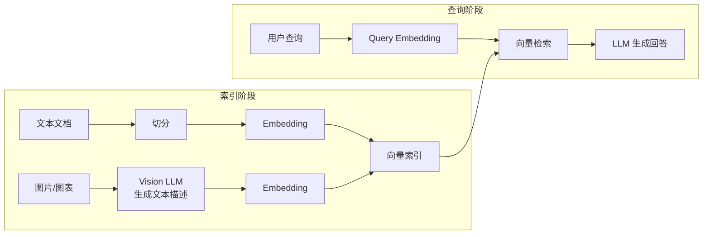
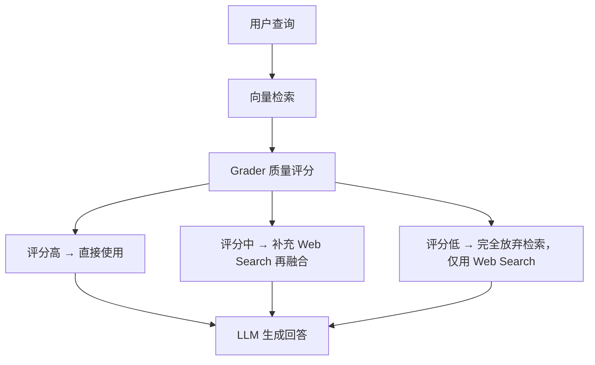
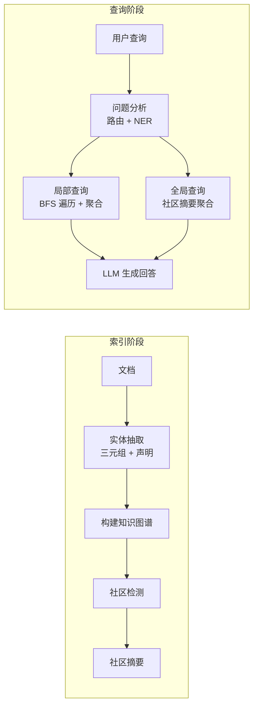
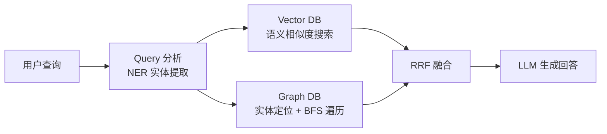
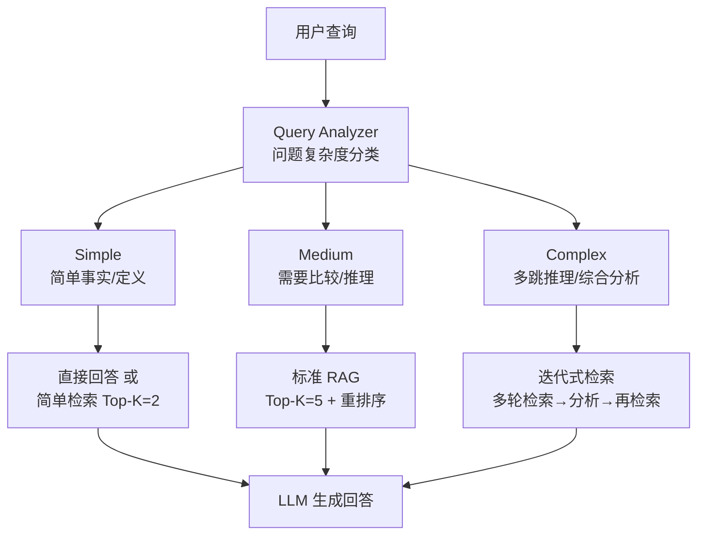
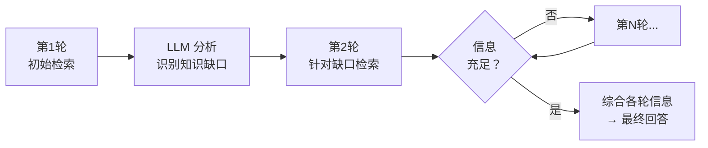
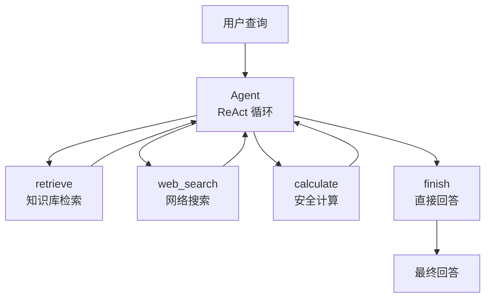
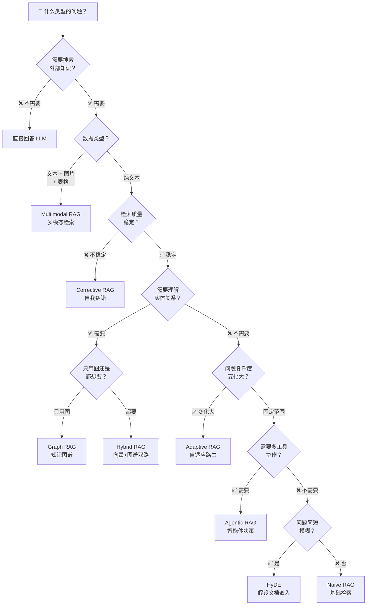

# 从朴素到智能体：8 种 RAG 架构的演进与选型指南

> 当你在构建 RAG 应用时，Naive RAG 只是起点。本文带你一次性搞懂 8 种主流 RAG 架构的核心思想、适用场景和选型决策。

---

## 一、为什么需要 8 种 RAG？

标准的 RAG 流程很简单：**用户提问 → 向量检索 → 拼接上下文 → LLM 生成回答**。这是最朴素的 RAG（Naive RAG），也是所有变体的起点。

但实际落地中你会发现：

| 问题 | 表现 |
|------|------|
| 短问题检索不准 | 用户说"这个怎么用"，向量搜到一堆不相关内容 |
| 检索到噪声 | LLM 被无关信息干扰，反而答错 |
| 只能搜文字 | 用户发张图片你就没辙了 |
| 缺乏关系推理 | "A 和 B 有什么关系？" 语义相似搜不到 |
| 所有问题一刀切 | 简单定义和复杂分析都用同一套流程 |

为了解决这些痛点，社区在过去两年中演化出了**8 种主流的 RAG 架构**，它们并非替代关系，而是针对不同场景的"武器库"。

---

## 二、8 种架构全景速览

从最基础的到最复杂的，这些架构沿着**三条主线**演进：

```mermaid
graph TD
    N["1. Naive RAG<br/>基础检索生成"] --> M["2. Multimodal RAG<br/>多模态支持"]
    N --> H["3. HyDE<br/>假设性文档嵌入"]
    N --> C["4. Corrective RAG<br/>检索纠错 + 质量评分"]
    N --> G["5. Graph RAG<br/>知识图谱关系推理"]
    G --> HR["6. Hybrid RAG<br/>向量 + 图谱双路融合"]
    N --> A["7. Adaptive RAG<br/>问题复杂度自适应路由"]
    N --> AG["8. Agentic RAG<br/>Agent 自主决策"]

    style N fill:"#e8f5e9",stroke:"#333"
    style AG fill:"#fff3e0",stroke:"#333"
```

**三条演进主线**：

| 主线 | 代表架构 | 解决的核心问题 |
|------|---------|--------------|
| **检索质量** | Naive → HyDE → Corrective RAG | 从"搜到就行"到"保证搜得准" |
| **信息广度** | Naive → Graph RAG → Hybrid RAG | 从"文本搜索"到"结构推理+语义理解" |
| **智能决策** | Naive → Adaptive → Agentic RAG | 从"固定管道"到"自主决策" |

---

## 三、8 种架构逐一拆解

---

### 1. Naive RAG — 所有 RAG 的起点

**一句话**：把问题向量化后去数据库搜最相似的内容，拼给 LLM 生成回答。


**流程拆解**：
1. 文档切分成 chunk，生成向量存入向量数据库
2. 用户提问时，把问题同样向量化
3. 在向量数据库中做余弦相似度搜索，取 Top-K 个 chunk
4. 把 chunk 拼入 Prompt 作为上下文
5. LLM 基于上下文生成回答

**优点**：
- 实现简单，链路最短
- 适合快速验证和原型开发

**缺点**：
- 检索质量没有保障，可能搜到不相关内容
- 没有纠错机制，搜错了 LLM 也跟着错
- 短问题、模糊问题的检索效果差

**最佳场景**：知识库内容质量高、问题类型单一、对延迟要求高的场景。

---

### 2. Multimodal RAG — 打破文本的边界

**一句话**：让 RAG 不仅能搜文字，还能搜图片、表格、音频等多媒体内容。



**三种实现方案**：

| 方案 | 做法 | 优点 | 缺点 |
|------|------|------|------|
| 方案一 | 统一多模态 Embedding（如 CLIP） | 原生多模态理解 | 模型可选范围小 |
| 方案二 | 图片 → LLM 生成文字描述 → 走文本 RAG | 生态成熟 | 信息可能丢失 |
| 方案三 | 检索后让多模态 LLM 直接处理原图 | 信息无损 | 成本高 |

**关键设计**：
- 图片描述需要缓存，避免重复调用 Vision LLM
- 每个 chunk 的 metadata 标注来源类型（text / image_description）
- 多模态 LLM（如 GPT-4V、Qwen-VL）是核心，负责"翻译"图片

**最佳场景**：
- 医疗影像报告问答
- 电商图片搜索与推荐
- 包含图表、截图的文档问答

---

### 3. HyDE（Hypothetical Document Embedding）— 让问题变得更像答案

**一句话**：不要拿问题去检索，先让 LLM 凭空生成一个"假设性回答"，用这个回答去检索。


**为什么有效？**

用户问题通常很短（5-15 词），而文档很长（几百词）。短向量和长向量在向量空间中的分布差异很大。一个"假设性回答"虽然在事实上可能不准确，但它在**语义结构、长度、信息密度**上与真实文档更接近，所以它的向量离真实文档更近。

| 检索方式 | 查询内容 | 相对检索质量 |
|---------|---------|:----------:|
| Naive 检索 | 原始问题（5-15 词） | 基准 |
| Query Expansion | 3-5 个扩展查询 | +10-15% |
| **HyDE** | 假设回答（100-500 词） | **+15-25%** |

**注意事项**：
- 假设回答**长度要适中**：太短（<50 词）≈ 直接检索，太长（>500 词）可能引入噪声
- 假设回答的**语义覆盖率**比事实准确性更重要
- 会增加一次 LLM 调用，有额外延迟和成本

**最佳场景**：
- 问题非常简短模糊（如"解释一下"、"这是什么"）
- 用户表达方式和文档表达方式差异很大
- 精度比延迟更重要的场景

---

### 4. Corrective RAG（CRAG）— 给检索加上自我纠错

**一句话**：检索后加一道"质量门禁"，评分高的直接用，评分低的自动补救。



**核心组件**：

1. **Grader（评分器）**：用 LLM 判断检索到的 chunk 与查询的相关性，打 0-10 分
2. **知识精炼**：对检索文档进行过滤，只保留真正相关的部分
3. **Web Search**：当本地知识库不够时，补充外部信息

**关键设计教训**：

**Grader 必须严格** — 评分标准需要明确区分"提到了"和"回答了"：

```
❌ 宽松版：chunk 提到了"CRISPE" → 7 分
✅ 严格版：chunk 只列了名词 → 3 分；chunk 解释了每个字母含义 → 8 分
```

**用 maxScore 而非平均分做路由决策**：

| 场景 | maxScore | 平均分 | 路由决策 |
|------|---------|-------|---------|
| 1 个好 chunk + 4 个噪声 | 8 | 2.4 | ❌ 平均分会误降级 |
| 全部高度相关 | 9 | 9.0 | ✅ 正确 |
| 完全不相关 | 1 | 1.0 | ✅ 正确 |

**成本**：每次查询需调用 LLM `TopK + 1` 次（评分 × TopK + 最终生成），K 值越大成本越高。

**最佳场景**：
- 知识库质量参差不齐，经常检索到不相关内容
- 对回答准确性要求极高的场景（金融、医疗、法律）
- 知识库更新不及时，需要实时信息补充

---

### 5. Graph RAG — 用知识图谱做关系推理

**一句话**：从文档中抽取出实体和关系构建知识图谱，沿着关系链路推理，而不是仅靠语义相似度。



**与 Naive RAG 的关键区别**：

| 维度 | Naive RAG | Graph RAG |
|------|----------|-----------|
| 检索方式 | 语义相似度搜索 | 实体关系路径遍历 |
| 信息粒度 | 文本 chunk | 实体 + 关系 + 声明 |
| 关系推理 | ❌ 不支持 | ✅ 支持多跳关系 |
| 全局理解 | ❌ 只能看局部 | ✅ 社区摘要聚合 |
| 可解释性 | 低（黑盒向量） | 高（可追踪关系路径） |

**两种查询模式**：

| 维度 | Local Search（局部） | Global Search（全局） |
|------|---------------------|----------------------|
| 触发 | 具体实体/概念 | 整体概览/分类 |
| 示例 | "什么是 CRISPE 框架？" | "有哪些提示词框架？" |
| 信息来源 | 图谱遍历 + 原文 | 所有社区摘要聚合 |
| LLM 调用 | 2 次 | 2 次 |

**适用场景**：
- 文档中实体关系密集（技术文档、法律合同、学术论文）
- 需要多跳推理的问题（"X 和 Y 有什么共同点？"）
- 需要全局概览（"这个领域有哪些主要流派？"）

**局限性**：
- 索引构建成本高（每个 chunk 需要 LLM 抽取实体）
- 实体链接（NL→图内实体）是一大难点

---

### 6. Hybrid RAG — 向量 + 图谱双剑合璧

**一句话**：同时用向量数据库做语义搜索 + 知识图谱做关系推理，结果融合后给 LLM。



**为什么要混合？**

| 检索方式 | 擅长 | 不擅长 |
|---------|------|--------|
| 向量检索 | 语义相似性、模糊匹配 | 结构化关系推理 |
| 图谱检索 | 关系推理、路径遍历 | 语义泛化、模糊查询 |
| **混合** | **语义理解 + 结构推理** | — |

**融合策略：RRF（Reciprocal Rank Fusion）**

```
RRF_score(d) = Σ 1 / (k + rank_i(d))
```

为什么 RRF 优于平均分融合？因为向量分（余弦相似度 0~1）和图谱分（深度衰减 0.4~1.0）的打分体系完全不同，直接平均分融合会产生偏差。RRF 天然解决了跨系统打分的对齐问题。

**融合结果类型**：

| 类型 | 含义 | 说明 |
|------|------|------|
| 向量独有 | 仅语义匹配到 | 图谱遍历未覆盖的 chunk |
| 图谱独有 | 仅通过关系链找到 | 向量相似度不够高 |
| 双路命中 | 两种检索器都认为相关 | 最核心的内容 |

**最佳场景**：
- 既需要语义理解又需要关系推理的复杂问题
- 知识库中实体间存在密集关系网络
- "A 和 B 有什么关系" + "A 是什么" 这类复合问题

**局限性**：
- 索引构建成本最高（同时构建向量索引和知识图谱）
- 查询延迟略高（双路检索 + NER 实体识别）

---

### 7. Adaptive RAG — 看人下菜碟

**一句话**：不要对所有问题用同一套策略。先判断问题复杂度，简单问题简单处理，复杂问题深度处理。



**问题复杂度分类标准**：

| 级别 | 特征 | 示例 |
|------|------|------|
| **Simple** | 单一事实、定义性 | "Python 是什么？" |
| **Medium** | 比较、解释、基础推理 | "A 和 B 有什么区别？" |
| **Complex** | 多跳推理、综合分析 | "如何结合多种架构设计系统？" |

**迭代式检索（Complex 路径的核心）**：



**停止条件**（满足任一即停止）：
1. **信息充足** — LLM 判断已回答完整
2. **达到最大轮数**（默认 3-5 轮）
3. **无新信息** — 连续两轮无新发现
4. **置信度达标**

**与 Agentic RAG 的区别**：

| 维度 | Adaptive RAG | Agentic RAG |
|------|-------------|-------------|
| 决策方式 | 预定义路由（Simple/Medium/Complex） | Agent 自主规划（ReAct 循环） |
| 灵活性 | 中等（固定策略集） | 高（动态工具调用） |
| 成本 | 可预测（2-7 次 LLM） | 不确定 |
| 工具范围 | 仅检索（不同粒度） | 检索 + 计算 + 任意工具 |

**最佳场景**：
- 问题类型跨度极大（既有"今天星期几"又有"分析某公司年报"）
- 希望根据不同问题平衡成本和质量
- 处理多跳推理问题的知识库

---

### 8. Agentic RAG — 让 AI 自己决定怎么做

**一句话**：不再用固定管道，而是让 Agent 自主规划——该检索就检索、该计算就计算、可以追问、可以多步推理。



**与前 7 种架构的本质区别**：

| 维度 | 前 7 种（固定管道） | Agentic RAG（动态规划） |
|------|-------------------|----------------------|
| 决策方式 | 预定义流水线 | Agent 实时决策 |
| 工具使用 | 固定检索 | 多工具按需调用 |
| 灵活性 | 低（流程固定） | 高（动态调整） |
| 可控性 | 高（流程可预测） | 低（结果不确定） |
| 复杂度 | ⭐⭐⭐ | ⭐⭐⭐⭐⭐ |

**关键设计模式 — ToolRegistry**：

Agent 通过工具注册机制动态发现和使用工具。每个工具有 name、description、parameters（JSON Schema）、execute 四个要素。description 让 LLM 理解工具的用途，parameters 让 LLM 知道怎么调用。

**三个关键设计决策**：

1. **单次 LLM 调用** — Thought 和 Action 合并为一次调用，比分开调用效率翻倍
2. **三层解析降级** — JSON 解析失败 → 正则匹配 → 默认 finish，永不卡死
3. **对话记忆（ChatMemory）** — 跨轮对话的上下文记忆，让 Agent 理解上下文

**典型的问题与解决方案**：

| 问题 | 根因 | 解决方案 |
|------|------|---------|
| Agent 检索不全面 | 单 query 检索，LLM 不会主动扩展 | 工具内部自动做 query 扩展 + 并行检索 |
| Agent 输出格式不稳定 | LLM 输出的 JSON 格式不一致 | 三层解析降级（JSON → Regex → Fallback） |
| 迭代轮数过多 | Agent 不知道什么时候该停 | 设置最大轮数 + Poka-Yoke 原则（智能封装在工具内部） |

**最佳场景**：
- 需要多工具协作（检索 + 计算 + API 调用）
- 问题类型高度不确定，难以预定义流程
- 需要多轮交互来完成复杂任务

**局限性**：
- Token 消耗高（每轮包含完整历史 + Prompt）
- 错误级联（某轮判断失误，后续难以纠正）
- 结果不确定，难以在生产环境做严格的 SLA 保障

---

## 四、8 种架构全景对比



### 完整对比表

| 架构 | 一句话概括 | 检索方式 | 纠错能力 | 关系推理 | 多模态 | 灵活性 | 复杂度 | 成本 |
|------|-----------|---------|---------|---------|-------|-------|-------|------|
| **1. Naive RAG** | 基础检索生成 | 向量检索 | ❌ | ❌ | ❌ | 低 | ⭐ | 低 |
| **2. Multimodal RAG** | 多模态检索生成 | 多模态向量 | ❌ | ❌ | ✅ | 中 | ⭐⭐ | 中 |
| **3. HyDE** | 假设回答去检索 | 向量检索 | ❌ | ❌ | ❌ | 中 | ⭐⭐ | 中 |
| **4. Corrective RAG** | 检索后自我纠错 | 向量检索 | ✅ | ❌ | ❌ | 中 | ⭐⭐⭐ | 中高 |
| **5. Graph RAG** | 知识图谱推理 | 图谱遍历 | ❌ | ✅ | ❌ | 中 | ⭐⭐⭐⭐ | 高 |
| **6. Hybrid RAG** | 向量+图谱双路融合 | 双路检索 | ❌ | ✅ | ❌ | 中 | ⭐⭐⭐⭐ | 高 |
| **7. Adaptive RAG** | 问题自适应路由 | 多策略选择 | ❌ | ❌ | ❌ | 中 | ⭐⭐⭐ | 中 |
| **8. Agentic RAG** | Agent自主决策 | 多工具按需 | ✅ | ✅ | ✅ | **高** | ⭐⭐⭐⭐⭐ | 高 |

### 成本 vs 质量概览

```
检索质量（检索准确率）
        ↑
   100% │                      🚀 Agentic RAG
        │                    🚀 Corrective RAG
    90% │                 🚀 Hybrid RAG
        │               🚀 Graph RAG
    80% │            🚀 Multimodal RAG
        │         🚀 Adaptive RAG
    70% │      🚀 HyDE
        │   🚀 Naive RAG
    60% │
        └──────────────────────────────→ 成本（LLM 调用次数 / 每次查询）
           低          中          高
```

---

## 五、选型决策指南

### 按阶段选择

| 你的阶段 | 推荐架构 | 理由 |
|---------|---------|------|
| 刚入门 RAG | Naive RAG | 理解最小可行流程 |
| 想提升质量 | HyDE → Corrective RAG | 先改检索，再加纠错 |
| 数据源复杂 | Multimodal RAG | 不只是文本 |
| 需要关系推理 | Graph RAG → Hybrid RAG | 先建图，再加向量 |
| 拥抱智能化 | Adaptive RAG → Agentic RAG | 先加路由，再加 Agent |

### 按场景选择

| 场景 | 推荐架构 | 备选方案 |
|------|---------|---------|
| 客服问答（简单问题多） | Adaptive RAG | Naive RAG + HyDE |
| 技术文档（实体关系密） | Graph RAG / Hybrid RAG | Corrective RAG |
| 研究报告（需综合分析） | Agentic RAG | Adaptive RAG（Complex 路径） |
| 电商商品搜索（含图片） | Multimodal RAG | Hybrid RAG + 图片标注 |
| 实时信息查询 | Corrective RAG（Web Search） | Agentic RAG |
| 学术论文检索 | HyDE + Corrective RAG | Graph RAG |

### 组合使用（进阶）

这些架构不是互斥的，可以组合：

```
Adaptive RAG (外层路由)
  ├── Simple → Naive RAG
  ├── Medium → Corrective RAG (带纠错)
  └── Complex → Agentic RAG (自主决策)
        ├── retrieve → Hybrid RAG (双路检索)
        └── calculate → 安全计算器
```

---

## 六、实践建议

**1. 不要一上来就用最复杂的架构**

Agentic RAG 看起来很酷，但如果你连 Naive RAG 的基础链路都没调通，Agent 只是在"更高效地犯错"。建议：先从 Naive RAG 起步，按需演进。

**2. 检索质量是 RAG 的命门**

不管用哪种架构，如果向量检索本身就搜不到相关内容，再多的"魔法"也救不了。Chunk 策略、Embedding 模型、索引策略永远是第一优先级。

**3. Grader 要好、Hallucination 要少**

无论是 Corrective RAG 还是 Agentic RAG，只要涉及"判断检索质量"，Grader 的严格程度就直接决定了你的上限。宁可漏掉一些边缘内容，也不要让噪声进入 LLM 的上下文。

**4. 成本不是简单数 LLM 调用次数**

Graph RAG 索引阶段成本高，但查询阶段成本极低（2 次 LLM）。Agentic RAG 每次查询成本不确定，但灵活性最高。结合你的查询/索引频率比来决定。

**5. 没有银弹**

没有一种架构适合所有场景。真实生产系统往往是多种架构的组合。**先理解你的问题特征，再选择对应的武器。**

---

## 七、写在最后

从 Naive RAG 的"检索然后生成"，到 Agentic RAG 的"观察→思考→行动→观察"，我们可以看到一条清晰的演进路径：

**越来越像人类处理信息的方式**：不是每次都要读完整本书（Adaptive RAG），遇到不懂的懂得翻上下文（HyDE），读完之后还会确认自己没读错（Corrective RAG），遇到复杂问题会画知识图谱（Graph RAG），最后还会灵活组合各种工具（Agentic RAG）。

这就是 8 种 RAG 架构的魅力——它们从不同角度解决了信息检索和生成中的实际问题。希望这篇文章能帮你找到适合自己场景的那一种（或几种）。

---

*本文内容参考了 LangChain / LlamaIndex 的技术实践方案。*