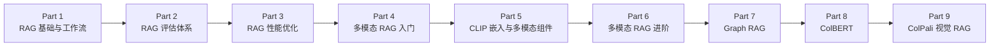

## Daily Dose of Data Science - RAG Crash Course 概览

这是一个由 **Avi Chawla** 和 **Akshay Pachaar** 撰写的 **RAG（检索增强生成）速成课程**，共 **9 个章节**，涵盖了从基础概念到高级进阶的完整 RAG 系统构建知识。每章都配有代码实现。

---

### 📘 Part 1 — RAG 系统基础 (Foundations of RAG Systems)

**核心内容：**
- **向量数据库回顾**：什么是向量数据库、向量嵌入（embedding）、ANN（近似最近邻）搜索算法
- **向量数据库在 RAG 中的作用**：为什么 LLM 需要向量数据库（知识更新问题、私有数据问题、避免重复训练）
- **RAG 术语拆解**：Retrieval（检索）+ Augmented（增强）+ Generation（生成）
- **RAG 系统完整工作流程**（7 个步骤）：
  1. 创建分块（Chunking）
  2. 生成嵌入（Embedding）
  3. 存储到向量数据库
  4. 用户输入查询
  5. 嵌入查询
  6. 检索相似分块
  7. 重排序分块（Re-ranking，使用 Cross-encoder）
- **使用框架**：Qdrant、LlamaIndex、Ollama 进行实现

---

### 📘 Part 2 — RAG 评估 (Evaluating RAG Systems)

**核心内容：**
- **为什么需要评估 RAG**：分块可能不精确、检索模型可能不准确、生成模型可能误解上下文
- **RAG 评估指标体系**：偏好无参考答案的（reference-free）自包含指标
- **关键评估维度**：
  - 检索质量评估
  - 生成质量评估
  - 端到端评估
- **自动化评估实现**

---

### 📘 Part 3 — 让 RAG 系统更快 (Making RAG Systems Faster)

**核心内容：**
- 深入探讨 RAG 系统的性能优化
- 检索速度优化策略
- 附带代码实现

---

### 📘 Part 4 — 多模态 RAG (Multimodal RAG)

**核心内容：**
- 处理多种数据类型（文本、图像等）的 RAG 系统
- 多模态 RAG 工作流程
- 第一次在课程中引入多模态概念
- 附带代码实现

---

### 📘 Part 5 — 多模态系统关键组件

**核心内容：**
- **CLIP 嵌入**：多模态嵌入模型的工作原理
- 多模态 RAG 系统的核心组件详解
- 深入理解视觉-语言模型的连接机制
- 附带代码实现

---

### 📘 Part 6 — 多模态 RAG（续）

**核心内容：**
- 多模态 RAG 的进一步深入
- 处理图像和文本混合数据的更高级方案
- 付费内容章节
- 附带代码实现

---

### 📘 Part 7 — Graph RAG（图检索增强生成）

**核心内容：**
- **Graph RAG vs 传统 RAG** 的对比
- 知识图谱在 RAG 中的应用
- Graph RAG 如何改进传统 RAG 系统的局限性
- 图结构如何帮助捕捉实体间关系
- 附带代码实现

---

### 📘 Part 8 — ColBERT 模型

**核心内容：**
- **ColBERT**（Contextual Late Interaction over BERT）深度解析
- ColBERT 的延迟交互机制 vs 传统 Bi-encoder 的差异
- ColBERT 在 RAG 系统中的优势
- 更精细的 token-level 匹配能力
- 附带代码实现

---

### 📘 Part 9 — ColPali（视觉驱动 RAG）

**核心内容：**
- **ColPali** 模型详解
- 使用 ColPali 构建 **视觉驱动（Vision-driven）** RAG 系统
- ColPali 如何将文档页面作为图像处理（而非 OCR 文本提取）
- 基于视觉理解的文档检索新范式
- 附带代码实现

---

### 🗺️ 课程整体知识路线图

**课程特点总结：**
- ✅ 每章都附带**完整代码实现**
- ✅ 从零到进阶的**渐进式学习路径**
- ✅ 覆盖了 RAG 的**三大维度**：基础架构 → 评估优化 → 高级技术
- ✅ 涵盖前沿技术：Graph RAG、ColBERT、ColPali
- ✅ 实用框架：Qdrant、LlamaIndex、Ollama
- ⚠️ Part 6 为付费内容