# RAG 优化完整全景图：从检索到生成的 14+ 种进阶技术

> 一篇系统梳理 RAG 优化技术栈的深度指南，覆盖检索前、检索中、检索后、生成四大阶段的全部主流方法。

---

## 前言

RAG（Retrieval-Augmented Generation）的标准流程是：**用户提问 → 向量检索 → 拼接上下文 → LLM 生成回答**。这是 Naive RAG 的"基线"。

但实际落地中，你会遇到各种问题：

| 问题 | 表现 | 根源 |
|------|------|------|
| 检索不相关 | LLM 基于错误信息回答 | 问题太模糊，与文档不匹配 |
| 检索不全面 | 答案遗漏关键信息 | 复杂问题需要多视角检索 |
| 上下文噪声 | LLM 被无关内容干扰 | 检索结果中混入太多不相关内容 |
| 生成幻觉 | LLM 编造不在上下文中的信息 | 缺乏忠实验证机制 |

解决这些问题，需要从 **四个阶段** 进行系统优化：**检索前 → 检索中 → 检索后 → 生成**。下面逐一详解。

---

## 全景总览

```mermaid
graph TD
    Q["User Query 用户问题"] --> PRE["Pre-Retrieval<br/>检索前优化"]
    PRE --> RET["Retrieval<br/>检索中优化"]
    RET --> POST["Post-Retrieval<br/>检索后优化"]
    POST --> GEN["Generation<br/>生成优化"]
    GEN --> A["Final Answer 最终回答"]

    subgraph PRE["检索前优化 Pre-Retrieval"]
        QD["Query Decomposition<br/>查询分解"]
        QE["Query Expansion<br/>查询扩展"]
        QR["Query Rewriting<br/>查询重写"]
        SB["Step-Back Prompting<br/>后退一步提问"]
        HYDE["HyDE<br/>假设性文档嵌入"]
        QROUTE["Query Routing<br/>查询路由"]
    end

    subgraph RET["检索中优化 Retrieval"]
        HYB["Hybrid Search<br/>混合检索稠密+稀疏"]
        MR["Multi-Route Retrieval<br/>多路召回"]
        MF["Metadata Filtering<br/>元数据过滤"]
        CH["Chunk Optimization<br/>分块策略优化"]
        IR["Iterative Retrieval<br/>迭代式检索"]
    end

    subgraph POST["检索后优化 Post-Retrieval"]
        RR["Re-Ranking<br/>重排序"]
        CC["Context Compression<br/>上下文压缩"]
        CRAG["Corrective RAG<br/>纠错RAG"]
        SRAG["Self-RAG<br/>自反思RAG"]
        DF["Decomposition & Fusion<br/>分解融合"]
    end

    subgraph GEN["生成优化 Generation"]
        PENG["Prompt Engineering<br/>提示词工程"]
        COV["Chain-of-Verification<br/>验证链"]
        FC["Faithfulness Check<br/>忠实性校验"]
        KD["Knowledge Distillation<br/>知识蒸馏"]
    end
```



---

## 一、检索前优化（Pre-Retrieval）：让问题变得更好问

检索前优化的核心思想是：**不要在检索这一步"直接使用"用户的原始问题。** 原始问题往往太短、太模糊、或者一次问了多个方面。检索前去处理问题，能极大提升后续所有环节的效果。

---

### 1.1 Query Decomposition（查询分解）

**核心思想**：一个问题包含多个方面时，很难找到一个文档能覆盖所有方面。把复杂问题拆成多个独立的子问题，分别检索，汇总结果。

**什么时候用？**
- 问题包含多个实体/概念（"对比 A 和 B"）
- 问题需要从不同角度回答（"是什么 + 为什么 + 怎么做"）
- 问题是跨领域的

**工作流程**：

```
复杂问题 → LLM(分解) → [子问题1, 子问题2, ...] → 分别检索 → 汇总结果 → LLM(最终生成)
```

**分解 Prompt 模板**：

```python
DECOMPOSITION_PROMPT_TEMPLATE = """
你是一个查询分析专家。请将用户提出的复杂问题，分解成一系列更简单的、可以独立回答的子问题。
请直接返回一个Python列表（List）格式的字符串。

复杂问题: "{question}"

分解后的子问题列表:
"""
```

**效果对比**：

| 场景 | 原始问题 | 分解后 | 效果 |
|------|---------|--------|------|
| 对比类 | "对比Refine和Map-Reduce策略的优缺点" | ① Refine 优点<br/>② Refine 缺点<br/>③ Map-Reduce 优点<br/>④ Map-Reduce 缺点 | 每路检索都能精准命中对应文档 |
| 多维类 | "Python在数据分析和Web开发中的表现" | ① Python数据分析能力<br/>② Python Web开发能力 | 不同子问题路由到不同知识库 |
| 层层递进 | "什么是RAG？它为什么重要？" | ① RAG 的基本定义<br/>② RAG 的重要性 | 先理解概念，再理解价值 |

**注意事项**：
- 子问题数量建议 **3-5 个**，太多会增加成本和延迟
- 子问题之间应**尽量独立**，避免互相依赖
- 可以设置**并行检索**来减少延迟

---

### 1.2 Query Expansion（查询扩展）

**核心思想**：用户的表达方式可能和文档的表达方式不一致。用 LLM 把问题展开成多个同义/近义表达，扩大召回面。

**示例**：

```
原始问题: "prompt常用框架"
    ↓ LLM 扩展
扩展查询: ["提示词工程框架", "Prompt Engineering frameworks", 
           "prompt模板方法论", "prompt技巧汇总", "prompt设计模式"]
    ↓ 分别检索后去重融合
```

**实现方式**：

```python
EXPANSION_PROMPT_TEMPLATE = """
你是一个查询扩展专家。请将用户的问题扩展为5个不同表达方式的查询，
每个查询从不同角度表达相同的信息需求。
直接返回Python列表格式。

原始问题: "{question}"

扩展后的查询列表:
"""
```

**关键要点**：
- 扩展数建议 **3-5 个**，太少效果不明显，太多噪声增加
- 扩展后做**去重**（去除语义高度相似的查询）
- 扩展查询**并行检索**，然后做 RRF 融合或去重合并

---

### 1.3 Query Rewriting（查询重写）

**核心思想**：用户的原始问题可能表述不清、缺少上下文（尤其是多轮对话中）。改写成一个更清晰、更适合检索的版本。

**什么时候特别有用？**
- 多轮对话：用户用代词（"它有什么优缺点？"）
- 口语化表达："那个啥，就是那个框架…"
- 问题太短："Explain this" — this 指代什么？

**示例**：

```
原始:    "它有什么优缺点？"（代词"它"指向不明）
    ↓ 改写
改写:    "CRISPE框架在提示词工程中有什么优缺点？"

原始:    "那个做向量搜索的叫什么？"
    ↓ 改写  
改写:    "做向量搜索的算法或工具叫什么名字？"
```

**Prompt 模板**：

```python
REWRITING_PROMPT_TEMPLATE = """
你是一个查询重写助手。用户的问题可能不完整、有歧义。
请将其改写成一个独立、清晰、适合检索的问题。
保留原始含义，不要添加无关信息。

如果有对话历史，请结合上下文理解问题中的代词指代。

对话历史:
{chat_history}

原始问题: "{question}"

改写结果:
"""
```

**与 Query Expansion 的区别**：

| 维度 | Query Rewriting | Query Expansion |
|------|----------------|----------------|
| 输出 | **1 个**更清晰的问题 | **多个**同义/近义问题 |
| 目标 | 消除歧义、补全上下文 | 扩大召回覆盖面 |
| 适用 | 模糊/省略/代词问题 | 表达单一/同义覆盖问题 |
| 可以结合 | 先改写 → 再扩展 → 分别检索 | |

---

### 1.4 Step-Back Prompting（后退一步提问）

**核心思想**：当用户问一个非常具体的问题时，先问一个更广泛的抽象问题，找到高层次的知识，再结合具体细节。

**原理**：具体问题对应的文档可能很分散，而抽象问题的文档通常更集中、更完整。先把抽象上下文拿到，再补充具体细节。

**示例**：

```
用户问题: "为什么在RAG中HyDE比Naive检索效果好？"
    ↓ 后退一步
抽象问题: "RAG中各种检索策略的比较和选择原则"  
    ↓ 并行检索
具体检索: "HyDE vs Naive RAG 效果对比分析"
    ↓ 融合
最终回答: 既有"检索策略对比"的宏观知识，又有"HyDE vs Naive"的具体细节
```

**Prompt 模板**：

```python
STEP_BACK_PROMPT_TEMPLATE = """
你是一个抽象推理专家。用户提出了一个具体问题。
请先"后退一步"，思考这个问题的更广泛、更抽象的形式是什么。
这个抽象问题应该能检索到回答问题所需的高层次背景知识。

具体问题: "{question}"

后退一步后的抽象问题:
"""
```

**适用场景**：
- 需要背景知识才能理解的具体问题
- 涉及专业术语/缩写的问题
- 需要从原理层面解释的现象/结果

---

### 1.5 HyDE（假设性文档嵌入）

**核心思想**：不直接用"问题"去检索，而是先让 LLM 凭空生成一个"假设性的、完美的答案"，再用这个假设答案的向量去检索。

**为什么有效？** 问题通常很短（10-20词），文档通常很长（几百词）。短向量和长向量在向量空间中的分布差异很大。一个"假设性答案"虽然在事实上可能不对，但它在**语义结构、长度、信息密度**上与真实文档更接近，所以它的向量在向量空间中离真实文档更近。

**工作流程**：

```
用户问题 → LLM 生成假设性回答 → Embedding → 用新向量检索 → LLM 用真实文档生成最终回答
```

**Prompt 模板**：

```python
HYDE_PROMPT_TEMPLATE = """
请根据以下问题，生成一个理想中的、详细的回答。
请注意，这个回答是用于后续检索的，不需要保证事实的绝对正确性，
但需要包含可能的相关信息和关键词。

问题: "{question}"

生成的理想回答:
"""
```

**效果对比**：

| 检索方式 | 查询内容 | 检索质量（经验值） |
|---------|---------|:----------------:|
| Naive 检索 | 原始问题（5-15词） | 基准 |
| Query Expansion | 3-5个扩展查询 | +10-15% |
| **HyDE** | 假设答案（100-500词） | **+15-25%** |

**⚠️ 注意事项**：
- HyDE 会增加一次 LLM 调用，有额外的延迟和成本
- 假设答案的**质量**（不是事实准确性，而是语义覆盖率）直接影响检索效果
- 假设答案太短（<50词）效果接近直接检索；太长（>500词）可能引入噪声
- **最适合的场景**：问题很短、很模糊；数据集信息密度高

---

### 1.6 Query Routing（查询路由）

**核心思想**：不是所有问题都用同一种检索策略。根据问题类型，路由到不同的检索策略或数据源。

**示例**：

```
用户问题
    ↓
问题分类器
    ├─ 事实性问题（"Python是什么？"）        → 百科/知识库
    ├─ 代码问题（"怎么用Python写二分查找？"） → 代码仓库/文档
    ├─ 时间敏感（"今天的股价是多少？"）       → 实时搜索引擎
    └─ 综合分析（"对比几种算法的优劣"）       → 多路检索 + 融合
```

**路由依据**：

| 路由类别 | 判断依据 | 目的 |
|---------|---------|------|
| **知识域** | 问题属于哪个领域 | 路由到对应的垂直知识库 |
| **复杂度** | 简单/中等/复杂 | 决定检索策略（单步/多步/迭代） |
| **时效性** | 是否需要最新信息 | 本地知识库 vs 搜索引擎 |
| **模态** | 文本/图片/音频 | 路由到不同模态的检索器 |

> **Note**：Adaptive RAG 就是 Query Routing 的一种特例——按问题复杂度路由到不同的检索策略。

---

## 二、检索中优化（Retrieval）：让检索本身更精准

检索中的优化关注的是**检索器本身**——包括用什么检索、怎么检索、检索时的参数配置。

---

### 2.1 Hybrid Search（混合检索）

**核心思想**：同时使用**稠密检索（Dense / 语义检索）**和**稀疏检索（Sparse / 关键词检索）**，各取所长。

**为什么需要混合？**

| 检索方式 | 能力 | 弱点 |
|---------|------|------|
| 稠密检索（Dense） | 语义理解强，"汽车"能匹配"轿车" | 对精确关键词不敏感 |
| 稀疏检索（BM25） | 精确匹配强，"CRISPE框架"能精确命中 | 无法处理语义同义词 |

**几种融合方案**：

```
1. RRF（Reciprocal Rank Fusion）
   score(d) = Σ 1/(k + rank_i(d))
   
   优点：不需要归一化分数，天然处理不同打分体系
   k 通常取 60

2. 加权平均融合
   score = α × dense_score + (1-α) × sparse_score
   
   优点：可动态调整权重
   缺点：需要分数归一化

3. Learning-to-Rank
   用模型学习如何融合多路检索结果
   
   优点：效果最好
   缺点：需要训练数据
```

**实用建议**：**RRF 是首选**，无需训练、无需归一化、实现简单、效果稳定。

---

### 2.2 Multi-Route Retrieval（多路召回）

**核心思想**：不只用一种检索方式，而是同时用**多种不同类型**的检索器，每种找出自己的 Top-K，然后融合。

**典型的多路组合**：

```
用户查询
  ├─ 密集向量检索（Dense Retrieval）    — 语义理解
  ├─ BM25 关键词检索（Sparse Retrieval） — 精确匹配  
  ├─ 知识图谱检索（Graph Retrieval）     — 关系推理
  ├─ SQL 结构化查询                    — 精确数据查询
  └─ Web Search                       — 实时信息补充
                    ↓
           RRF 融合 → Top-N → LLM 生成
```

**优势**：每种检索方式都有盲区。多路召回能互补盲区，极大提高召回率。

**成本**：检索延迟增加（多路并行一般可接受），但融合后的 Top-N 质量远高于单路。

---

### 2.3 Chunk Optimization（分块策略优化）

**核心思想**：文档切分的方式直接影响检索质量。不同的文档类型、不同的查询类型，适合不同的分块策略。

**常见分块策略**：

| 策略 | 做法 | 适用场景 | 
|------|------|---------|
| 固定大小切分 | 每 N 个 tokens 一刀切 | 通用 |
| 语义切分 | 按段落/主题边界切 | 长文档、技术文档 |
| 递归字符切分 | 按换行→句号→逗号逐级切割 | 代码、结构化文本 |
| 滑动窗口 | 小窗口检索，返回大窗口上下文 | 长上下文问答 |
| Sentence Window | 检索单句，返回前后 N 句 | 精确事实问答 |

**推荐配置**（经验值）：

| 场景 | Chunk Size | Overlap | 策略 |
|------|-----------|---------|------|
| 事实性问答 | 256-512 tokens | 10-20% | 固定大小 |
| 文档摘要/综述 | 1024-2048 tokens | 5-10% | 语义切分 |
| 代码检索 | 按函数/类 | 0 | 语义切分 |
| 长文档分析 | 小chunk(128) + 大窗口(1024) | - | Sliding Window |

**关键原则**：
- **Chunk Size 越小**，检索精度越高，但上下文可能不完整
- **Chunk Size 越大**，上下文越完整，但可能混入噪声
- **Overlap** 防止信息在切分边界被切断
- 最好根据文档类型**动态选择**切分策略

---

### 2.4 Metadata Filtering（元数据过滤）

**核心思想**：在向量检索前后，用元数据（时间、分类、来源、作者等）过滤，缩小搜索范围，提高精度。

**示例流程**：

```
查询: "2024年RAG有哪些新进展？"

Step 1: 实体提取 → "2024年"（时间实体）
Step 2: 向量检索 Top-20（语义相似度匹配）
Step 3: 元数据过滤 → 只保留 date >= 2024-01-01 的 chunk
Step 4: 保留 Top-5 送入 LLM
```

**常用元数据维度**：

| 维度 | 过滤方式 | 场景示例 |
|------|---------|---------|
| 时间 | date >= 阈值 | "2024年的最新进展" |
| 分类/标签 | category IN [...] | "找技术类的相关文章" |
| 来源/作者 | source = X | "XX 发表的观点" |
| 文档类型 | doc_type = Y | "只看技术论文" |
| 语言 | lang = Z | "找中文资料" |

**两阶段过滤策略**：

```
阶段1（检索前过滤）: 
  用元数据缩小搜索空间 → 只在相关子集内做向量检索
  
阶段2（检索后过滤）:
  向量检索后，再用元数据做二次过滤
  → 适合"语义相关但元数据不匹配"的场景
```

---

### 2.5 Iterative Retrieval（迭代式检索）

> 也称 Multi-Step Retrieval 或 Stepwise Retrieval

**核心思想**：不是一次性检索所有内容，而是通过多轮"检索 → 分析 → 缺口识别 → 再检索"逐步完善答案。

**工作流程**：

```
第1轮: 初始检索 → LLM 初步分析 → 识别知识缺口
                                    ↓
第2轮: 针对缺口检索 → LLM 补充分析 → 仍有缺口？
                                    ↓
第N轮: ... → 直到满足停止条件或达到最大轮数
                                    ↓
                            综合所有轮次信息 → 最终回答
```

**停止条件**（满足任一即停止）：
1. **信息充足**：LLM 判断当前上下文已能充分回答问题
2. **最大轮数**：默认 3-5 轮，避免无限循环
3. **无新信息**：连续两轮未检索到新内容
4. **置信度达标**：LLM 对答案的置信度 > 阈值

**成本控制策略**：

| 优化措施 | 效果 |
|---------|------|
| 限制最大轮数（默认3轮） | 避免无限循环 |
| 每轮 Top-K 递减（5→3→2） | 后续轮次聚焦核心 |
| 去重机制 | 避免重复检索相同内容 |
| 早期停止 | 信息充足立即终止 |

---

## 三、检索后优化（Post-Retrieval）：让检索结果更精炼

检索后优化的核心是：**检索到的文档不一定都相关，相关的不一定都精炼。** 需要在送入 LLM 之前做进一步的质量把关。

---

### 3.1 Re-Ranking（重排序）

**核心思想**：向量检索（Bi-Encoder）只能做粗排——它计算的是"问题"和"文档"的语义相似度，但无法区分"提到了相关概念"和"真正回答了问题"。Re-Ranking 用更精细的模型（Cross-Encoder 或 LLM）对 Top-K 结果重新打分排序。

**为什么需要重排序？**

```
向量检索结果（Bi-Encoder 粗排）:
  [score: 0.85] "CRISPE框架是一种提示词框架..."    ← 只提到了概念
  [score: 0.80] "框架列表包括：CRISPE, BROKE..."   ← 真正列出了列表
  [score: 0.72] "好的提示词框架能提升效果..."       ← 提到但未回答

    ↓ Cross-Encoder / LLM 重排序

重排序结果:
  [score: 95/100] "框架列表包括：CRISPE, BROKE..."  ← 真正回答了问题
  [score: 65/100] "CRISPE框架是一种提示词框架..."    ← 只提到了概念
  [score: 30/100] "好的提示词框架能提升效果..."      ← 不相关
```

**两种实现方式**：

| 方式 | 精度 | 速度 | 成本 |
|------|:---:|:----:|:----:|
| **Cross-Encoder**（如 BGE-Reranker） | 高 | 快 | 低（专用模型） |
| **LLM 重排序**（用 GPT/Qwen 打分） | 更高 | 慢 | 高（需调 LLM） |

**实用建议**：
- Top-K 较大时（≥20），先向量检索初筛，再用 Cross-Encoder 精排
- Top-K 较小时（≤10），直接用 LLM 重排序更简单
- LLM 重排序时一次传入所有 chunk 批量打分，不要逐个调

---

### 3.2 Context Compression（上下文压缩）

**核心思想**：检索到的文档块可能很长，但其中只有一小部分真正相关。压缩掉无用信息，节省 Token、减少噪声、提升生成质量。

**压缩方法**：

```
方法1: 提取式压缩（Extractive）
  "在RAG系统中...（大量背景）...CRISPE框架五要素是 C-R-I-S-P..."
  → 提取关键句: "CRISPE框架五要素为：Capacity and Role, Insight, ..."

方法2: 摘要式压缩（Abstractive）
  → LLM 生成摘要: "CRISPE框架的五个要素包括C(Role)、R(Insight)..."

方法3: 选择性压缩（Selective Context）
  → 用模型计算每个 token 的重要性 → 只保留重要 token
  → 工具: LLMLingua, Selective-Context
```

**压缩率与质量权衡**：

| 方法 | 压缩率 | 信息保留 | 额外成本 |
|------|:-----:|:--------:|:--------:|
| 不压缩 | 0% | 100% | 无 |
| 截断（取前N字符） | 50-80% | 不确定 | 无 |
| 提取式压缩 | 60-80% | ~90% | 1次 LLM 调用 |
| LLMLingua | 80-95% | ~85% | 轻量模型 |
| 摘要式压缩 | 80-90% | ~85% | 1次 LLM 调用 |

**最佳实践**：
- Token 预算紧张时优先使用
- 压缩前先做相关性过滤（不相关的 chunk 直接丢弃，不压缩）
- 长文档优先用提取式压缩，短文档直接用原文

---

### 3.3 Corrective RAG（纠错 RAG）

**核心思想**：检索后增加一个**质量评估**环节。如果检索结果质量不好，启动纠错机制：补充搜索或完全放弃检索结果。

**流程**：

```
用户查询 → 向量检索 → 检索结果评分
                          ├─ 评分高 → 直接用检索结果
                          ├─ 评分中 → 补充网络搜索再融合
                          └─ 评分低 → 完全放弃检索，仅用网络搜索
                                    ↓
                              LLM 生成回答
```

**评分器（Grader）设计**：

```python
GRADER_PROMPT_TEMPLATE = """
请评估以下检索到的文档片段是否与用户问题相关。

问题: {question}

文档: {document}

请输出一个 JSON:
{{
  "relevance_score": 0-10,  // 相关性评分
  "reason": "评分理由"
}}

评分标准:
0-3: 不相关或只提到了关键词但没有回答
4-7: 部分相关，提供了部分有用信息
8-10: 高度相关，直接回答了问题
"""
```

**路由决策策略**——用 `maxScore + refinedCount` 联合决策：

| 场景 | maxScore | 高分段数量 | 路由 |
|------|----------|-----------|------|
| 一个好 chunk + 四个噪声 | 8 | 1 | **high** |
| 全部高度相关 | 9 | 5 | **high** |
| 部分沾边 | 4 | 2 | **medium** |
| 完全不相关 | 1 | 0 | **low** |

> **⚠️** 使用 `maxScore + 高分段数量` 而非平均分。因为平均分在"一个好文档+四个噪声"的情况下会被错误拉低。

---

### 3.4 Self-RAG（自反思 RAG）

**核心思想**：在生成答案前，让 LLM 对每个检索结果做**逐条反思**——判断每个 chunk 是否真正对回答问题有帮助。

**与 Corrective RAG 的本质区别**：

| 维度 | CRAG | Self-RAG |
|------|------|---------|
| 粒度 | **整体**评估检索质量 | **逐条**评估每个 chunk |
| 决策 | 路由（高/中/低） | 筛选（保留/丢弃） |
| 额外信息 | 检索结果 + Web Search | 自我反思 + 支持证据 |

**流程**：

```
Query → Retrieval → [Chunk1, Chunk2, ..., ChunkN]
                     ↓
LLM 对每个 Chunk 逐条判断：
  ├─ is_relevant:  该chunk与问题相关吗？
  ├─ is_supported: 该chunk的信息有事实支撑吗？
  └─ is_useful:    该chunk对回答有帮助吗？
                     ↓
             只保留 [is_relevant=true && is_useful=true] 的 Chunk
                     ↓
              LLM 生成最终回答
```

**Prompt 模板**：

```python
SELF_RAG_PROMPT_TEMPLATE = """
请对以下检索到的文档片段进行分析，判断其是否有助于回答用户问题。

问题: {question}

文档片段: {chunk}

请输出以下字段的 JSON:
{{
  "is_relevant": true/false,    // 该片段是否与问题相关
  "is_supported": true/false,   // 片段中的信息是否有事实来源支撑
  "is_useful": true/false,      // 该片段是否对回答问题有实际帮助
  "reason": "判断理由"
}}
"""
```

**成本**：需要为每个 chunk 调用一次 LLM（或批量处理），Top-K 值越大成本越高。建议 Top-K ≤ 5。

---

### 3.5 Decomposition & Fusion（分解融合）

**核心思想**：检索后对返回的文档再做一轮"理解 → 识别缺口 → 再检索"的循环，直到信息足够。

**工作流程**：

```
Step 1: 检索到 N 个文档
Step 2: LLM 分析已有信息
Step 3: 识别"信息缺口"——还缺什么？
Step 4: 针对缺口生成新的子查询
Step 5: 再检索 → 回到 Step 2
Step 6: 信息充足 → 融合所有轮次信息 → 最终回答
```

这个和 Iterative Retrieval（检索中优化）的区别在于：**Iterative Retrieval 是检索执行者多次检索；Decomposition & Fusion 是检索后分析者发现缺口后要求再检索。** 两者在实践中通常合并使用。

---

## 四、生成优化（Generation）：让输出更可靠

生成优化的核心是：**LLM 的输出不一定忠实于检索结果。** 需要增加验证和校验机制。

---

### 4.1 Prompt Engineering（提示词工程）

**核心思想**：通过精心设计 LLM 的输入提示词，来约束和控制生成行为，让模型更严格地遵循检索到的上下文，减少自由发挥和幻觉。

提示词工程不是一种"算法"或"流程"，而是 **RAG 系统中成本最低、见效最快**的优化手段——只需修改提示词，无需改动代码架构。

**为什么在 RAG 中格外重要？**

在普通对话中，LLM 可以自由发挥。但在 RAG 中，LLM 的核心任务是**忠实于检索结果**。如果提示词没有明确约束，LLM 很容易：

- 用自己的知识"补充"不在上下文中的信息（幻觉）
- 忽略检索结果，直接回答（忽略上下文）
- 输出格式不规整，难以下游解析

**核心技巧**：

| 技巧 | 说明 | 示例 |
|------|------|------|
| **角色设定** | 给 LLM 一个明确的角色，约束其行为边界 | "你是一个严谨的研究助手，只根据提供的资料回答" |
| **指令约束** | 明确要求只能基于上下文，不能添加外部知识 | "如果问题的答案不在上下文中，请直接说'无法从提供的资料中找到答案'" |
| **格式约束** | 指定输出的结构和格式 | "请用 JSON 格式输出：{\"answer\": ..., \"confidence\": ...}" |
| **示例引导** | 提供 1-3 个输入输出示例 | "示例：问题→回答（格式示范）" |
| **否定指令** | 明确告诉 LLM 不要做什么 | "不要总结，不要添加你的观点" |

**Prompt 模板示例**：

```python
RAG_SYSTEM_PROMPT = """你是一个严谨的 RAG 问答助手。请严格遵守以下规则：

1. **只基于上下文回答**：你只能使用以下"检索结果"中的信息来回答问题。
2. **不确定就说不知道**：如果问题无法从检索结果中找到答案，请直接说"抱歉，我无法从现有资料中找到这个信息"，不要编造。
3. **引用来源**：在回答中注明信息来自哪段文档。
4. **简洁准确**：不要添加与问题无关的信息，不要过度展开。

检索结果：
{context}

用户问题：{question}
请给出你的回答："""
```

**最佳实践建议**：

1. **系统提示 + 用户提示分离**：系统提示放角色和规则，用户提示放问题和上下文，不要混在一起
2. **否定指令 > 肯定指令**：告诉 LLM "不要做什么" 通常比 "要做什么" 更有效
3. **位置效应**：关键指令放在提示词的开头和结尾（LLM 对中间内容注意较少）
4. **迭代优化**：通过 bad case 分析，逐步完善提示词——这是持续的过程
5. **结合 Chain-of-Thought**：让 LLM 先分析检索结果再给出答案，能提升回答质量

**局限性**：

- 提示词不能解决所有问题——如果检索不到相关内容，再好的提示词也没用
- 提示词对"幻觉抵抗"的效果有限——需要结合 Faithfulness Check 等机制
- 提示词越复杂，LLM 越容易忽略部分指令——保持简洁

---

### 4.2 Chain-of-Verification（验证链）

**核心思想**：LLM 生成初步回答后，不直接返回。而是让它**自我验证**——针对回答中的事实性声明，生成验证问题，用检索结果逐条验证，纠正错误。

**流程**：

```
Step 1: 生成初步回答
Step 2: 提取回答中的事实性声明（"X是什么" "Y导致了Z"）
Step 3: 对每个声明生成验证问题
Step 4: 用检索结果逐条验证
Step 5: 标记已验证/已修正的声明
Step 6: 返回最终经过验证的回答
```

**示例**：

```
用户: "HyDE和Query Decomposition有什么区别？"

Step 1 - 初步回答:
  "HyDE是LLM先生成假设回答再检索；Query Decomposition是将问题拆成子问题。"

Step 2 - 提取声明:
  - "HyDE生成假设回答" ✅
  - "HyDE用假设回答检索" ✅  
  - "Query Decomposition拆解问题" ✅

Step 3 - 验证:
  → 检索确认所有声明 → 全部正确 ✅

Step 4 - 最终回答: （保留原回答）
```

> 如果验证发现声明错误（幻觉），则修正后再输出。

**检验 Prompt 模板**：

```python
VERIFICATION_PROMPT_TEMPLATE = """
以下是基于检索结果生成的回答。请提取其中的事实性声明，
并对照检索结果验证每个声明的正确性。

检索结果: {context}

生成回答: {answer}

请输出 JSON 格式的验证结果:
{{
  "claims": [
    {{
      "claim": "事实性声明1",
      "verified": true/false,
      "evidence": "来自检索结果的证据",
      "correction": "如果错误，正确的说法是什么"
    }},
    ...
  ],
  "overall_verdict": "all_correct / needs_correction"
}}
"""
```

---

### 4.3 Faithfulness Check（忠实性校验）

**核心思想**：确保 LLM 的输出**完全基于检索到的内容**，而不是模型自身的"知识"（即幻觉）。

**与 Chain-of-Verification 的区别**：

| 维度 | Chain-of-Verification | Faithfulness Check |
|------|----------------------|-------------------|
| 视角 | 回答中的事实是否正确 | 回答中的事实是否在检索结果中 |
| 目的 | 纠正事实错误 | 消除幻觉 |
| 方法 | 验证声明→检索确认 | 检查每句话→是否有原文支撑 |

**实现方式**：

```
方式1: NLI（自然语言推理）
  用 NLI 模型判断"回答"是否被"上下文"蕴含
  不蕴含 → 标记为幻觉 → 删除或修正
  
方式2: 逐句溯源
  对回答中的每句话，在检索结果中找原文支撑
  找不到支撑 → 标记为幻觉
  
方式3: LLM 自评
  让 LLM 检查自己的输出："这句话在给定的上下文中有来源吗？"
```

**Prompt 模板**：

```python
FAITHFULNESS_PROMPT_TEMPLATE = """
检查以下回答中的每一句话是否都有检索结果作为支撑。
如果某句话没有在检索结果中找到直接来源，请标记出来。

检索结果: {context}

回答: {answer}

输出 JSON:
{{
  "sentences": [
    {{
      "text": "句子原文",
      "faithful": true/false,
      "source": "对应的原文片段或null",
      "action": "keep/delete/rewrite"
    }},
    ...
  ]
}}
"""
```

### 4.4 Knowledge Distillation（知识蒸馏）

**核心思想**：用强大的大语言模型（教师模型）生成高质量的 RAG 训练数据，训练一个小型模型（学生模型），使其在 RAG 场景下达到接近大模型的效果，同时显著降低推理延迟和成本。

**为什么 RAG 需要知识蒸馏？**

| 挑战 | 说明 |
|------|------|
| **延迟** | RAG 流程中已有检索+生成两个环节，用大模型生成进一步增加延迟 |
| **成本** | 高吞吐场景下频繁调用大模型，Token 消耗巨大 |
| **部署** | 大模型部署资源要求高，小模型更适合边缘/私有化部署 |

**蒸馏的两种主要方式**：

```
方式1: 输出蒸馏（Output Distillation）
  教师模型(L) → 生成 RAG 回答 → 作为训练数据 → 学生模型(S) 学习模仿

  适用: 用 GPT-4 生成答案，微调 LLaMA-7B 在 RAG 场景下的能力

方式2: 偏好蒸馏（Preference Distillation）
  教师模型 → 对多个候选回答打分排序 → 作为偏好信号 → 学生模型 DPO/RLHF 训练

  适用: 不只需要模仿，还需要理解"什么回答更好"
```

**RAG 蒸馏的完整流程**：

```
Step 1: 收集 RAG 场景的多样化用户查询
Step 2: 用教师模型（如 GPT-4/Qwen-Max）生成高质量回答
Step 3: 对生成的回答做质量筛选（人工/自动）
Step 4: 用筛选后的数据微调学生模型
Step 5: 在 RAG 测试集上评估学生模型效果
```

**蒸馏数据生成 Prompt 模板**：

```python
DISTILLATION_DATA_PROMPT = """你是一个高质量的 RAG 回答生成器。
请根据以下检索结果，生成一个精确、忠实、完整的答案。

要求:
1. 严格基于检索结果，不要添加外部知识
2. 如果检索结果不足以回答问题，明确说明缺失的信息
3. 回答应结构化、易读
4. 涉及多个要点时使用列表

检索结果:
{context}

问题:
{question}

高质量回答:
"""
```

**效果对比**：

| 对比维度 | 直接用小模型 | 蒸馏后的小模型 | 直接用手建模 |
|---------|:-----------:|:------------:|:----------:|
| 回答质量 | 基准 | +20-35% | 最高（基准*） |
| 推理延迟 | 低 | 低 | 高（3-10倍） |
| Token 成本 | 低 | 低 | 高（5-20倍） |
| 部署资源 | 低 | 低 | 高 |

**注意事项**：

1. **数据质量 > 数据数量**：1000 条高质量蒸馏数据的效果可能超过 10000 条低质量数据
2. **教师模型补知识 + 学生模型做推理**：让教师模型补充检索结果中缺失的背景知识，学生模型在此基础上做推理回答
3. **持续蒸馏**：随着检索数据更新，需要定期重新蒸馏，保持学生模型的知识鲜度
4. **结合 LoRA**：用 LoRA 等参数高效微调方法，降低蒸馏成本
5. **评估先行**：蒸馏前先评估学生模型的基线，蒸馏后对比提升

---

## 五、各阶段优化方法总结

### 5.1 完整对比表

| 阶段 | 方法 | 核心思想 | 额外 LLM 调用 | 延迟影响 | 效果提升 |
|:----:|------|---------|:------------:|:-------:|:-------:|
| **检索前** | Query Decomposition | 大问题拆子问题 | 1次 | 中 | ★★★★ |
| | Query Expansion | 同义/近义扩展 | 1次 | 低(并行) | ★★★ |
| | Query Rewriting | 改写问题更清晰 | 1次 | 低 | ★★★★ |
| | Step-Back Prompting | 退一步问抽象问题 | 1-2次 | 中 | ★★★ |
| | HyDE | 生成假设回答再检索 | 1次 | 中 | ★★★★ |
| | Query Routing | 按类型路由不同策略 | 0-1次 | 低 | ★★★★ |
| **检索中** | Hybrid Search | Dense + Sparse | 0次 | 低 | ★★★ |
| | Multi-Route Retrieval | 多种检索器同时召回 | 0-N次 | 中 | ★★★★ |
| | Chunk Optimization | 最优分块策略 | 0次 | 低(索引) | ★★★★★ |
| | Metadata Filtering | 按元数据预过滤 | 0-1次 | 低 | ★★★ |
| | Iterative Retrieval | 多轮检索逐步完善 | N次 | 高 | ★★★★ |
| **检索后** | Re-Ranking | 重排序提精排 | 0-1次 | 中 | ★★★★★ |
| | Context Compression | 压缩上下文降噪 | 0-1次 | 中 | ★★★ |
| | Corrective RAG | 检索质量评分纠错 | TopK次 | 中 | ★★★★ |
| | Self-RAG | 逐chunk自我反思 | TopK次 | 中 | ★★★★ |
| **生成** | **Prompt Engineering** | 精心设计提示词约束生成 | 0次 | 低 | ★★★ |
| | Chain-of-Verification | 生成后自验证 | 2-3次 | 高 | ★★★★ |
| | Faithfulness Check | 确保忠实于上下文 | 1-2次 | 中 | ★★★★ |
| | **Knowledge Distillation** | 大模型蒸馏小模型提效 | N次(离线) | 低(推理时) | ★★★★ |

### 5.2 场景化推荐组合

| 场景 | 推荐组合 | 理由 |
|------|---------|------|
| 多轮对话问答 | **Query Rewriting + Re-Ranking + CRAG** | 重写消歧，重排序精排，纠错兜底 |
| 长文档分析 | **Chunk Optimization + Re-Ranking + Context Compression** | 语义切分+精排+压缩，降噪不丢信息 |
| 综合分析类 | **Query Decomposition + Hybrid Search + RRF Fusion** | 分解子问题，多路检索，融合汇总 |
| 生产环境高要求 | **Prompt Engineering + HyDE + Hybrid Search + Re-Ranking + Self-RAG + Faithfulness Check** | 全链路优化，每一环都把关 |
| 低延迟场景 | **Prompt Engineering + Query Rewriting + Chunk Optimization + 轻量Re-Ranking** | Prompt Engineering 零成本，加上必要的环节控制延迟 |
| 资源受限 | **Prompt Engineering + Chunk Optimization + Metadata Filtering** | 几乎零额外成本，纯工程 + 提示词优化 |

### 5.3 选型决策树

```
你的 RAG 系统需要优化吗？
│
├─ 检索结果不相关（召回问题）
│  ├─ 问题太模糊 → Query Rewriting / Query Expansion / HyDE
│  └─ 问题太复杂 → Query Decomposition
│
├─ 检索结果不完整（覆盖率问题）
│  ├─ 语义覆盖不足 → Hybrid Search / Multi-Route Retrieval
│  └─ 需要多步推理 → Iterative Retrieval / Decomposition & Fusion
│
├─ 检索结果噪声大（精度问题）
│  ├─ 混入不相关内容 → Re-Ranking / Self-RAG
│  └─ 文档太长信息分散 → Context Compression / Chunk Optimization
│
└─ 生成结果不准确（生成问题）
   ├─ 内容有幻觉 → **Prompt Engineering** / Faithfulness Check
   ├─ 事实性错误 → Chain-of-Verification
   ├─ 回答不全面 → Query Decomposition + 多路融合
   └─ 成本延迟高 → **Knowledge Distillation**
```

---

## 六、写在最后

RAG 的优化不是"一招鲜"，而是**系统工程**：

1. **优先修复最痛的环节**
   - 检索不相关 → 先查检索前和检索中
   - 答案质量差 → 先查检索后和生成

2. **成本和效果做权衡**
   - 每加一个 LLM 调用环节，延迟和成本都会增加
   - 从低成本方案开始优化（Chunk Optimization, Metadata Filtering）
   - 效果还不满足再加高成本方案（HyDE, Self-RAG）

3. **组合使用效果 > 单一方法**
   - Query Rewriting + Re-Ranking + CRAG 是三件套搭配
   - 不要只用一个方法，也不要一次性全上

4. **持续评估和迭代**
   - 每次优化后都要做 A/B 测试或评估
   - 不同知识库、不同用户群体，最优组合可能不同
   - 定期回溯 bad case，找到新的优化方向

---

> **一句话总结**：从"检索前"到"生成"，每个环节都有对应的优化技术。先诊断最痛的问题，选择最合适的工具，逐步打磨，而不是追求一次性上齐所有方法。