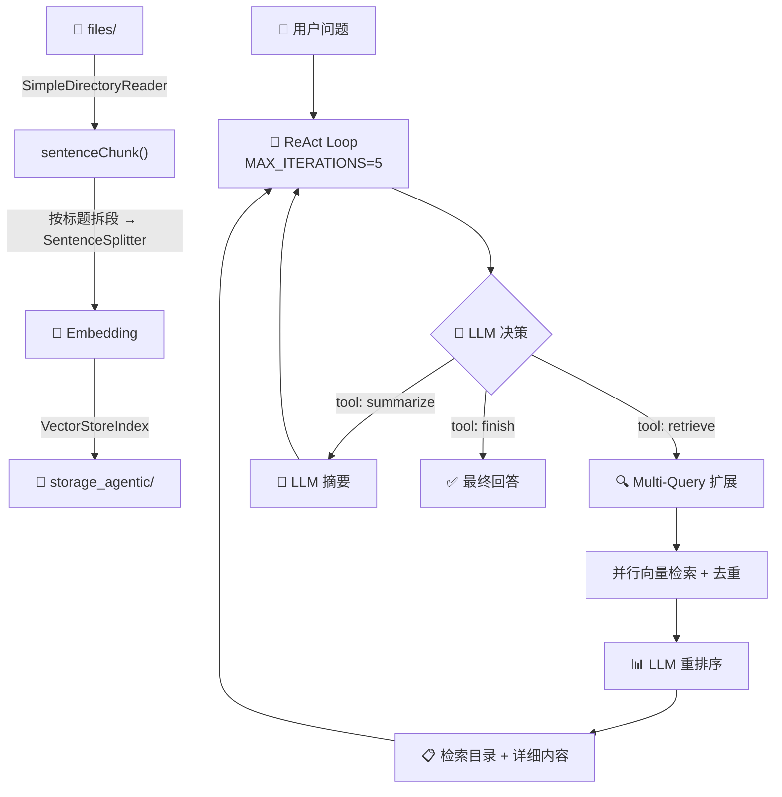

# DocAgent — Agentic RAG 文档问答系统

基于 LlamaIndex + ReAct 模式的智能文档问答 Agent，支持本地/云端双模式部署。

> 📊 测试结果：18/18 用例全部通过，100% 召回率

---

## 架构总览

```
用户问题 → ReAct Loop → retrieve / summarize / finish
                ↑              │
                └── Observation ┘
```



---

## 快速开始

```bash
# 1. 安装依赖
cd LangChain/apps/DocAgent
pnpm install

# 2. 配置环境变量（在 LangChain/.env 中）
# 云端模式（默认）：
OPENAI_API_KEY=your-key
OPENAI_BASE_URL=https://dashscope.aliyuncs.com/compatible-mode/v1
OPENAI_MODEL=qwen-plus

# 本地模式：
LOCAL_API_KEY=ollama
LOCAL_BASE_URL=http://localhost:11434/v1
LOCAL_MODEL=qwen2.5:7b

# 3. 启动
pnpm agent           # 本地模式（MODULE=local）
# 或
MODULE=default tsx --env-file=../../.env src/index.ts  # 云端模式
```

将待检索的文档（.txt / .md）放入 `files/` 目录即可。首次运行会自动切分 → 向量化 → 建索引，后续启动直接加载持久化索引。

---

## 项目结构

```
DocAgent/
├── src/
│   ├── index.ts        # 主入口：ReAct 循环 + 工具定义 + CLI 交互
│   ├── chunk.ts        # 文档切分：sentenceChunk / windowChunk / recursiveChunk
│   ├── config.ts       # 全局 Settings 初始化（解决 pnpm 模块隔离问题）
│   ├── llm.ts          # LLM 封装：本地/云端/视觉三模式 + Token 跟踪
│   ├── embedding.ts     # Embedding 配置：bge-m3（本地）/ text-embedding-v3（云端）
│   └── constants.ts    # 全局路径常量
├── files/              # 知识库文档
├── storage_agentic/     # 向量索引持久化
├── cache/              # 切分结果缓存
├── log/                # Token 使用日志
├── TEST_CASES.md       # 测试报告
└── Q.md                # 问题记录
```

---

## 核心设计

### 1. ReAct 推理循环

Agent 遵循 **Thought → Action → Observation** 循环，每轮 LLM 输出结构化 JSON：

```json
{
  "thought": "分析当前情况...",
  "tool": "retrieve | summarize | finish",
  "params": { "query": "...", "topK": 5 },
  "response": "最终答案（仅 finish 时）"
}
```

关键设计点：
- **单次 LLM 调用同时输出 Thought + Action**，而非两次分开调用，减少延迟和 token 消耗
- **最大 5 轮迭代**硬限制，防止死循环
- **Observation 相似度检测**：连续两轮 Observation 重叠 > 70% → 强制结束
- **对话记忆**：最近 6 轮历史传入 ReAct prompt，支持跨轮上下文理解

### 2. 工具集

| 工具 | 功能 | 关键特性 |
|------|------|---------|
| `retrieve` | 从知识库检索 | Multi-Query 自动扩展 + 并行检索 + 去重 + LLM 重排序 |
| `summarize` | 文本摘要 | 支持 focus 参数定向总结 |
| `finish` | 输出最终答案 | 终止循环 |

### 3. 文档切分策略

采用 **按标题拆段 + SentenceSplitter** 的混合策略：

```
原始文本 → splitByHeadings() → [{path, content}] → 每段独立切分 → 【path】chunk
```

- 先按 Markdown 标题（`# ~ ######`）拆成独立段落
- 每段用 `SentenceSplitter` 切分（chunkSize=512, overlap=50）
- 每个 chunk 加上**祖先路径标签**（如 `【提示词工程 > 常用提示词框架 > 1. CRISPE 框架】`），提升语义辨识度
- 切分结果自动缓存，避免重复计算

---

## 设计决策：问题 → 根因 → 方案

以下是开发过程中遇到的核心问题及解决思路，按影响力排序。

### Q1: 检索召回盲区 — "列出所有框架"只返回 3 个

**现象**：用户问"提示词有哪些常用框架"，Agent 只返回 CRISPE、BROKE、COSTAR 3 个，实际有 8 个。

**根因**：

```
用户："提示词常用框架有哪些"
  → Agent: retrieve["提示词框架"]（单 query）
  → 向量搜索 topK=5 → chunk 0 排第一（含总述+CRISPE详解）
  → Agent 换关键词 → 依然是模糊 query → 还是 chunk 0
  → 5 轮用完 → "信息主要集中在CRISPE框架上"
```

三个深层因素：

| 因素 | 说明 |
|------|------|
| **Query Underspecification** | 用户问题太宽泛，检索器不知道该找什么 |
| **Search Surface Area** | 单 query 只探索 Embedding 空间的一个小区域 |
| **Breadth-First Failure** | "列举所有 X" 类问题在单 Agent 系统中尤其困难 |

**解决方案演进**：

| 版本 | 方案 | 效果 |
|------|------|------|
| v1 | Prompt 引导多关键词 | ❌ LLM 记不住用逗号分隔 |
| v2 | 工具内部自动 query expansion | ✅ 扩大搜索覆盖 |
| v3 | Poka-Yoke 工具设计（Anthropic 推荐） | ✅ 智能封装在工具内部，不让 LLM 自己做决策 |

**最终方案**：`expandQuery()` + `📋 检索目录`

- **Multi-Query 扩展**：让 LLM 将宽泛查询拆解为 3-5 个不同语义角度的子查询，并行检索后去重
- **📋 检索目录**：Observation 不再塞 9 个完整 chunk（~13500 字符），而是先输出紧凑目录，LLM 一屏扫完全貌

Multi-Query 解决三个盲区的原理：

| 盲区 | 原理 | 效果 |
|------|------|------|
| 查询欠指定 | 3-5 个不同角度的 query 覆盖侧面 | "提示词框架" + "prompt engineering" + "设计模式" |
| 搜索表面积 | 每个 query 探索 Embedding 空间不同区域 | 3-5 个点 → 覆盖面积 3-5 倍 |
| 广度优先失败 | 不同角度 query 命中不同 chunk | 不再只命中 CRISPE 那一块 |

**验证**：Q1 从 ❌ 只答 3/8 → ✅ 全部 8 个框架正确列出。

---

### Q2: ReAct 死循环 — 5 轮全浪费在重复检索

**现象**：Agent 反复用相似关键词检索，每轮命中相同 chunk，5 轮用完还没出答案。

**各框架的反循环策略对比**：

| 框架 | 反循环策略 | 核心依赖 |
|------|-----------|---------|
| Claude Code | 模型不输出 tool_use → 自然停止 + maxTurns + Hook 拦截 | 模型本身 |
| OpenAI Agents SDK | max_turns + Guardrails 钩子 | 模型本身 |
| LangGraph | 状态图显式定义边（有限状态机），没有循环边就不会死循环 | 架构决定 |
| **DocAgent** | MAX_ITERATIONS 硬限制 + Observation 相似度检测 | 代码层拦截 |

**最终方案**：
1. `MAX_ITERATIONS = 5` 硬限制
2. 连续两轮 Observation 相似度 > 70% → 强制结束并基于已有信息生成答案
3. 低分过滤（< 15% 的检索结果直接丢弃，< 50% 发出警告），避免 LLM 在噪音中反复检索

---

### Q3: Hallucination — 回答包含知识库里没有的内容

**方案**：双重防护

1. **Prompt 约束**：`如果检索结果与用户问题不相关或信息不足，必须明确告知用户知识库中未找到相关内容，不得根据自身知识编造`
2. **低分过滤**：检索结果 score < 50% 时输出警告，< 15% 直接过滤；过滤后无结果时明确告知"知识库中未找到"

**验证**：Q17（AGI/ASI/Transformer 在哪个文档）→ 诚实地回答"未找到"，而非编造。

---

### Q4: Observation 过长 — LLM 只看前几条就 finish

**现象**：9 个完整 chunk ~13500 字符塞给 LLM，它只读到前 3 个就认为"信息充足"然后 finish。

**方案**：检索目录 + 详细内容分离

```
📋 检索目录（共 13 项）:
[1] 70% 提示词工程 > 常用提示词框架 > 1. CRISPE 框架
[2] 67% 提示词工程 > 提示词框架 vs 推理技术
[3] 67% 提示词工程 > 常用提示词框架 > 2. BROKE 框架
...

━━━ 详细内容 ━━━
[1] (69.8%)
CRISPE 框架是一种结构化提示词方法...
```

LLM 先扫描目录了解全貌，再按需查看详细内容。这使得"列举所有"类问题不再遗漏。

---

### Q5: LLM 重排序 — 模拟 Cross-Encoder

**原理**：向量检索（bi-encoder）只做语义相似度，无法区分"相关但没回答"和"真正回答了"。

**方案**：让 LLM 对每个 chunk 打分（0-100），按分重新排序。为控制成本，仅在 chunk 数 ≤ 12 时执行，超量回退向量分排序。

---

### Q6: SentenceWindowNodeParser 只用了一半

**发现**：`SentenceWindowNodeParser` 的设计哲学是**检索用 text（精确匹配），展示用 window（完整上下文）**，我们只用了 text，相当于丢了一半功能。

**当前状态**：暂未启用 window 展示，预留为后续优化方向。

---

### Q7: SentenceSplitter 数字编号误判

**发现**：LlamaIndex `SentenceSplitter` 对 `\d+.\d` 这种数字带小数点的模式处理不好，会误判为列表项编号（如 "1.1 早期教育" 被切分成列表项）。

**当前状态**：通过 `splitByHeadings` 先按标题拆段绕过了此问题，但 SentenceSplitter 内部的该局限仍存在。

---

### Qn: LLM 调用重试的坑

Agent 主循环「调 LLM → 拿到 tool_call → 执行工具 → 把结果塞回上下文 → 再调 LLM」，某次调用因上游 5xx 失败了，直觉是加 `@retry(max_attempts=3)`，但 LLM 调用和普通 HTTP 请求有几个根本差异：

1. **按 token 计费**：失败重试不是免费的——尤其是上下文已经几万 token 的时候
2. **工具副作用**：如果是流式响应中断在工具调用之后，重试一次相当于副作用执行两次
3. **流式续接**：响应已经吐出了一半，从哪里续接、是否要丢弃，直接影响用户感知

**结论**：LLM 调用的重试策略需要比 HTTP 重试更精细，不能简单照搬。

---

## 已解决的工程问题

| 问题 | 修复方案 |
|------|---------|
| pnpm 依赖提升导致 Settings 隔离 | `config.ts` 同时设置 `llamaindex` 和 `@llamaindex/core/global` 的 Settings |
| LLM 输出 JSON 含未转义换行符 | `sanitizeJSON()` 逐字符修复，三级降级解析策略 |
| 向量分 9200% 显示 bug | LLM 重排序分数归一化到 0-1 |
| chunk 标签重复 | `splitByHeadings()` 按标题拆段后独立切分，每段只加一次标签 |
| 不必要的 summarize 调用 | Prompt 规则 + 示例引导，"单一片段已能回答时直接 finish" |

---

## 配置说明

### 环境变量

| 变量 | 云端默认值 | 本地默认值 | 说明 |
|------|-----------|-----------|------|
| `MODULE` | `default` | `local` | 选择 LLM/Embedding 模式 |
| `OPENAI_API_KEY` | — | — | 阿里云 DashScope API Key |
| `OPENAI_BASE_URL` | `https://dashscope.aliyuncs.com/compatible-mode/v1` | — | 云端 API 地址 |
| `OPENAI_MODEL` | `qwen-plus` | — | 云端 LLM 模型 |
| `LOCAL_API_KEY` | — | `ollama` | 本地 API Key |
| `LOCAL_BASE_URL` | — | `http://localhost:11434/v1` | Ollama 地址 |
| `LOCAL_MODEL` | — | `qwen2.5:7b` | 本地 LLM 模型 |
| `EMBED_MODEL` | `text-embedding-v3` | — | 云端 Embedding 模型 |
| `LOCAL_EMBED_MODEL` | — | `bge-m3` | 本地 Embedding 模型 |

### Token 跟踪

`llm.ts` 通过 Proxy 包装自动追踪每次 LLM 调用的 token 用量，会话结束时输出统计报告，同时写入 `log/session_*.log` 和 `log/cumulative.log`。

---

## 测试结果

详见 [TEST_CASES.md](./TEST_CASES.md)

| 层级 | 测试数 | 通过 | 召回率 |
|:-----|:-------|:-----|:-------|
| L1 简单 | 5/5 | 5 | **100%** |
| L2 中等 | 5/5 | 5 | **100%** |
| L3 复杂 | 4/4 | 4 | **100%** |
| L4 边界 | 4/4 | 4 | **100%** |
| **合计** | **18/18** | **18** | **100%** |

---

## 后续优化方向

| 方向 | 价值 | 说明 |
|------|:----:|------|
| 流式输出 | 体验 | 让用户实时看到 Agent 思考过程 |
| 多格式文档 | 通用性 | 支持 PDF、Word 等 |
| Graph RAG | 深度 | `constants.ts` 已预留 `CACHE_GRAPH_INDEX` |
| 自动评估 | 效率 | 18 个测试用例自动运行 + 自动评分 |
| Window 上下文展示 | 召回质量 | Q6：检索用 text，展示用 window |
| LLM 调用重试 | 鲁棒性 | Qn：需要比 HTTP 重试更精细的策略 |
