The user wants me to translate my previous analysis of hermes-agent's core harness technologies into Chinese.
## Hermes-Agent 核心 Harness 技术全景

hermes-agent 的 "harness"（骨架/框架）技术是指支撑整个 Agent 系统运行的底层架构组件，而非狭义的测试 harness。这些技术构成了 Agent 从接收用户消息到完成任务的完整执行管线。

```mermaid
flowchart TB
    subgraph CoreLoop["1. Agent 对话循环"]
        A["AIAgent.run_conversation"]
        A --> B{"是否中断?"}
        B -->|否| C["LLM API 调用"]
        C --> D{"有工具调用?"}
        D -->|是| E["工具调度与执行"]
        D -->|否| F["返回响应"]
        E --> G["追加工具结果"]
        G --> B
        subgraph Budget["迭代预算"]
            H["max_iterations: 90"]
            I["IterationBudget.consume/refund"]
        end
    end

    subgraph ToolSystem["2. 工具编排框架"]
        J["ToolRegistry - 注册/分发"]
        K["Toolsets - 启用/禁用分组"]
        L["model_tools - 获取工具定义/处理函数调用"]
        M["tool_executor - 并发 vs 顺序"]
        N["tool_guardrails - ToolCallGuardrailController"]
        J --> K --> L
        L --> M
        M --> N
    end

    subgraph EnvHarness["3. 环境/沙箱框架"]
        O["BaseEnvironment ABC"]
        P["本地"]
        Q["Docker"]
        R["SSH"]
        S["Modal"]
        T["Daytona"]
        U["Singularity"]
        O --> P & Q & R & S & T & U
    end

    subgraph Delegation["4. 委派框架"]
        V["delegate_task - 生成子Agent"]
        W["leaf 角色 - 专注工作者"]
        X["orchestrator 角色 - 多级生成"]
        Y["max_spawn_depth: 2"]
        Z["max_concurrent_children: 3"]
        V --> W & X
        X --> Y & Z
    end

    subgraph Memory["5. 记忆框架"]
        AA["MemoryManager - 编排器"]
        AB["MemoryProvider ABC"]
        AC["honcho / mem0 / supermemory / ..."]
        AA --> AB --> AC
    end

    subgraph Compression["6. 上下文压缩框架"]
        AD["ContextCompressor"]
        AE["ContextEngine ABC"]
        AF["SUMMARY_PREFIX 指令"]
        AD --> AE --> AF
    end

    subgraph Security["7. 安全框架"]
        AG["approval.py - 强硬/危险模式"]
        AH["check_all_command_guards"]
        AI["tirith_security"]
        AJ["file_safety / path_security"]
        AG --> AH --> AI --> AJ
    end

    subgraph Plugin["8. 插件框架"]
        AK["PluginManager - 发现/注册"]
        AL["生命周期钩子 - 工具/LLM前后"]
        AM["ctx.register_tool/register_cli_command"]
        AK --> AL --> AM
    end

    subgraph MCP["9. MCP 集成框架"]
        AN["MCPServerTask - stdio/http"]
        AO["SamplingHandler"]
        AP["熔断器 + 自动重连"]
        AN --> AO --> AP
    end

    subgraph Checkpoint["10. 检查点框架"]
        AQ["CheckpointManager - 影子 git 仓库"]
        AR["new_turn / ensure / diff / restore"]
        AQ --> AR
    end

    A --> ToolSystem
    A --> EnvHarness
    A --> Delegation
    A --> Memory
    A --> Compression
    A --> Security
    A --> Plugin
    A --> MCP
    A --> Checkpoint
```

---

### 1. **Agent 对话循环** (`agent/conversation_loop.py` + `run_agent.py`)

核心骨架 — 整个 Agent 的执行主循环：

- `run_conversation()` 是主入口（4222 行代码），驱动从用户消息到最终响应的完整流程
- 循环条件：`api_call_count < max_iterations` 且 `iteration_budget.remaining > 0`（含宽限调用）
- 中断检查：`_interrupt_requested` 允许用户中止当前任务
- 消息格式遵循 OpenAI 规范：`{"role": "system/user/assistant/tool", ...}`
- 推理内容存储在 `assistant_msg["reasoning"]` 中
- 迭代预算由 `IterationBudget` 类管理（消耗/退还/宽限调用）

**关键文件**：`run_agent.py`（约1.2万行）、`agent/conversation_loop.py`（4222行）、`agent/agent_init.py`（8.6万行）、`agent/iteration_budget.py`

---

### 2. **工具编排框架** (`tools/registry.py` + `model_tools.py` + `agent/tool_executor.py`)

工具发现、注册、调度、并发执行的完整框架：

- **ToolRegistry**：单例 `registry` 对象，`register()` 注册 schema + handler，`dispatch()` 执行分发，`get_definitions()` 按 toolset 过滤生成 schema
- **Toolset 分组**：`toolsets.py` 定义 `TOOLSETS` 字典，每个平台选择一个基础 toolset（如 Telegram 用 `messaging`），`_HERMES_CORE_TOOLS` 是默认基础包
- **并行/顺序执行**：`execute_tool_calls_concurrent` 和 `execute_tool_calls_sequential` 两种模式，并发上限 `_MAX_TOOL_WORKERS = 8`
- **工具护栏**：`ToolCallGuardrailController` 在调用前/后检查重复调用、失败分类、幂等性检测
- **自动发现**：`tools/*.py` 中任何 `registry.register()` 调用自动被发现并导入

**关键文件**：`tools/registry.py`、`model_tools.py`（5.4万行）、`agent/tool_executor.py`、`toolsets.py`、`agent/tool_guardrails.py`

---

### 3. **环境/沙箱框架** (`tools/environments/`)

六种终端后端，为工具执行提供隔离的执行环境：

- `BaseEnvironment` ABC 定义 `execute()`、`init_session()`、`_wait_for_process()`、`_wrap_command()` 等接口
- **本地（Local）**：本地 shell 执行
- **Docker**：容器隔离（5.4万行，最完整的后端）
- **SSH**：远程服务器执行
- **Modal**：无服务器 GPU 集群（按需唤醒，闲置时几乎零成本）
- **Daytona**：开发环境沙箱（按需持久化）
- **Singularity**：HPC 风格容器
- `_ThreadedProcessHandle` 将异步执行包装为同步接口

**关键文件**：`tools/environments/base.py`、`tools/environments/docker.py`、`tools/environments/local.py`、`tools/environments/ssh.py`、`tools/environments/modal.py`、`tools/environments/daytona.py`

---

### 4. **委派框架** (`tools/delegate_tool.py`)

子 Agent 生成与管理框架：

- **delegate_task**：生成隔离的子 Agent，父 Agent 同步等待子 Agent 结果
- **两种形态**：单一模式（`goal` 参数）和批量/并行模式（`tasks: [...]` 参数，并发上限 3）
- **角色隔离**：`leaf` 角色禁止调用 `delegate_task/clarify/memory/send_message/execute_code`；`orchestrator` 角色可再生成子 Agent（深度上限 2）
- **子 Agent 构建**：`_build_child_agent()` 从父 Agent 继承模型/凭据/工具集配置，生成独立系统提示词
- **心跳监控**：`_HEARTBEAT_INTERVAL = 30秒`，检测子 Agent 卡死

**关键文件**：`tools/delegate_tool.py`（2915行）

---

### 5. **记忆框架** (`agent/memory_manager.py` + `plugins/memory/`)

可插拔的记忆系统骨架：

- **MemoryManager**：编排所有 MemoryProvider 的生命周期
  - `prefetch_all()` / `queue_prefetch_all()`：异步预取相关记忆
  - `sync_all()`：回合结束后同步写入
  - `on_turn_start()` / `on_session_end()`：回合级钩子
  - `StreamingContextScrubber`：实时过滤 `<memory-context>` 标签，防止记忆内容泄露到模型输出
- **MemoryProvider ABC**：`sync_turn()`、`prefetch()`、`shutdown()`、`post_setup()`
- **8+ 内置 Provider**：honcho、mem0、supermemory、byterover、hindsight、holographic、openviking、retaindb
- **新 Provider 策略**：不再允许新增仓库内 provider，必须作为独立插件仓库发布

**关键文件**：`agent/memory_manager.py`、`agent/memory_provider.py`、`plugins/memory/*/`

---

### 6. **上下文压缩框架** (`agent/context_compressor.py` + `agent/context_engine.py`)

长对话的自动压缩框架：

- **ContextCompressor**：当对话接近上下文窗口上限时自动触发
  - 保护头部（系统提示词 + 早期消息）和尾部（最近消息）
  - 用辅助模型（廉价/快速）压缩中间回合
  - `SUMMARY_PREFIX` 指令确保模型将压缩摘要视为背景参考而非活跃指令
  - 工具输出先修剪（廉价预检）再送 LLM 摘要化
  - 按比例分配摘要预算（`_SUMMARY_RATIO = 0.20`，上限 `_SUMMARY_TOKENS_CEILING = 12,000`）
- **ContextEngine ABC**：`should_compress_preflight()` 判断是否需要压缩，`threshold_percent = 0.75`
- **缓存保护**：压缩绝不破坏提示词缓存 — 仅在上下文压缩时改变过去上下文

**关键文件**：`agent/context_compressor.py`（10万行）、`agent/context_engine.py`

---

### 7. **安全框架** (`tools/approval.py` + `agent/file_safety.py` + `tools/tirith_security.py`)

多层安全防护框架：

- **审批系统**：`prompt_dangerous_approval()` / `check_all_command_guards()`
  - **HARDLINE_PATTERNS（强硬模式）**：绝对阻止的危险命令（`rm -rf /`、`mkfs`、`dd of=/dev/` 等）
  - **DANGEROUS_PATTERNS（危险模式）**：需要用户确认的危险操作
  - `check_execute_code_guard()` 专门审查代码执行
  - YOLO 模式：`HERMES_YOLO_MODE` 跳过所有审批
  - Gateway 模式：`_await_gateway_decision()` 跨平台异步审批
- **Tirith 安全引擎**：第三方安全扫描引擎
- **文件安全**：路径安全验证、敏感文件保护（`.ssh/`、`.env`、`config.yaml`）
- **DM 配对**：Gateway 的消息配对验证

**关键文件**：`tools/approval.py`（1749行）、`tools/tirith_security.py`、`agent/file_safety.py`、`tools/path_security.py`

---

### 8. **插件框架** (`hermes_cli/plugins.py` + `plugins/`)

可扩展的插件框架：

- **PluginManager**：从 `~/.hermes/plugins/`、`.hermes/plugins/`、pip entry points 发现插件
- **生命周期钩子**：`pre_tool_call`、`post_tool_call`、`pre_llm_call`、`post_llm_call`、`on_session_start`、`on_session_end`
- **ctx API**：`register_tool()`、`register_cli_command()` — 无需修改核心代码
- **隔离原则**：插件禁止修改核心文件（`run_agent.py`、`cli.py`、`gateway/run.py` 等）
- **模型提供商插件**：独立的延迟发现系统，后写入者覆盖

**关键文件**：`hermes_cli/plugins.py`、`plugins/*/`

---

### 9. **MCP 集成框架** (`tools/mcp_tool.py`)

Model Context Protocol 集成框架：

- **MCPServerTask**：每个 MCP server 作为独立任务运行
  - 支持 stdio 和 HTTP 两种传输模式
  - `_run_stdio()` / `_run_http()` 启动和连接
  - `_refresh_tools()` 定期刷新工具列表
  - **熔断器**：连续 3 次错误后熔断，60 秒冷却后重试
  - **会话过期**：自动检测会话过期并重连
  - **OAuth**：`mcp_oauth_manager.py` 处理 OAuth 认证流程
- **SamplingHandler**：允许 MCP server 回调 Agent 的 LLM（反向调用）
- **并发安全**：`_parallel_safe_servers` 标记可并行调用的 MCP server

**关键文件**：`tools/mcp_tool.py`（3921行）、`tools/mcp_oauth.py`、`tools/mcp_oauth_manager.py`

---

### 10. **检查点框架** (`tools/checkpoint_manager.py`)

基于 Git 影子仓库的状态快照框架：

- **CheckpointManager**：每次回合前自动创建项目状态快照
  - 使用影子 git 仓库（`.hermes/checkpoints/store/`）存储差异
  - `new_turn()` → `ensure_checkpoint()` → `_take()` 创建快照
  - `diff()` 查看当前与快照的差异
  - `restore()` 回滚到快照状态
  - `_enforce_size_cap()` 限制存储上限（`checkpoint_max_total_size_mb = 500`）
- **自动清理**：自动清理过期快照（`checkpoint_max_snapshots = 20`）

**关键文件**：`tools/checkpoint_manager.py`（1643行）

---

### 总结对比表

| Harness 技术 | 核心文件 | 代码行数 | 核心抽象 |
|---|---|---|---|
| Agent 对话循环 | `conversation_loop.py` | 4222 | `run_conversation()` + `IterationBudget` |
| 工具编排 | `registry.py` + `model_tools.py` | 5.4万+ | `ToolRegistry` + `Toolsets` + `execute_tool_calls_*` |
| 环境/沙箱 | `environments/base.py` + 6个后端 | ~15万 | `BaseEnvironment` ABC |
| 委派 | `delegate_tool.py` | 2915 | `delegate_task()` + leaf/orchestrator 角色 |
| 记忆 | `memory_manager.py` | 858 | `MemoryManager` + `MemoryProvider` ABC |
| 上下文压缩 | `context_compressor.py` | ~2500 | `ContextCompressor` + `ContextEngine` ABC |
| 安全 | `approval.py` + `tirith_security.py` | 1749+ | 强硬/危险模式 + Tirith |
| 插件 | `plugins.py` | ~3000 | `PluginManager` + 生命周期钩子 + ctx API |
| MCP 集成 | `mcp_tool.py` | 3921 | `MCPServerTask` + 熔断器 + `SamplingHandler` |
| 检查点 | `checkpoint_manager.py` | 1643 | `CheckpointManager` + 影子 git 仓库 |

这些 harness 技术共同构成了 hermes-agent 从消息接收、模型推理、工具执行、环境隔离、安全审批、记忆管理、上下文压缩到状态恢复的完整闭环。每一层都是可插拔的（ABC 接口 + 插件机制），使得系统可以在不修改核心代码的前提下灵活扩展。