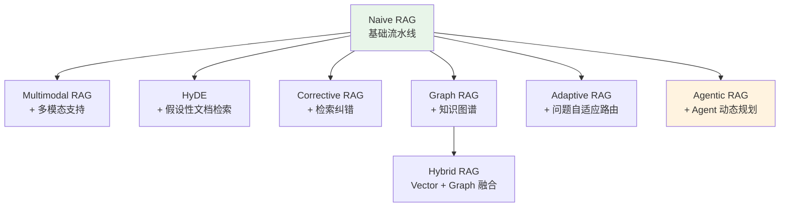

# 8种RAG架构详解

## 1. Naive RAG（朴素 RAG）

最基础的 RAG 架构，一条直线流水线：

```
用户查询 → Query Embedding → 向量检索 → 拼接上下文 → LLM 生成回答
```

**核心流程**：
1. 用户提问
2. 将问题进行 Embedding 向量化
3. 在向量数据库中做相似度检索，取 Top-K 分块
4. 将检索到的分块作为上下文拼入 Prompt
5. LLM 基于上下文生成回答

**优点**：实现简单，链路短
**缺点**：检索质量无法保证，可能检索到不相关内容；没有纠错机制；对复杂问题效果差

---

## 2. Multimodal RAG（多模态 RAG）

扩展传统文本RAG，支持**图片、音频、视频**等多模态数据的检索与生成：

```
多模态文档 → 多模态 Embedding → 多模态 Vector DB
                                         ↓
用户查询（文本/图片/音频） → 多模态检索 → 多模态 LLM 生成回答
```

**核心思路**：
- **方案一**：将所有模态统一 Embedding 到同一向量空间（需 CLIP 等多模态 Embedding）
- **方案二**：用多模态LLM（如 GPT-4V / qwen-vl-plus）将图片描述为文本，再走文本 RAG 流程 ← **已实现**
- **方案三**：直接用多模态 LLM 处理检索到的原始多模态内容

**实现文件**：`2.Multimodal RAG.ts`（采用方案二）

**方案二详细流程**：
```
Step 1: 加载文本文档（PDF 等）
Step 2: 加载图片 → Vision LLM (qwen-vl-plus) 生成文本描述
Step 3: 合并 [文本文档 + 图片描述文档]
Step 4: 统一切分 → Embedding → 向量索引
Step 5: 查询 → 向量检索 → LLM 生成回答
```

**关键设计**：
- Vision LLM 使用阿里云 `qwen-vl-plus` 模型
- 图片描述结果会被缓存（`cache/image_descriptions.json`），避免重复调用
- 每个 chunk 的 metadata 中标注来源类型（`image_description` / text）
- 索引持久化到独立的 `storage_multimodal/` 目录

**适用场景**：医疗影像、电商图片搜索、视频问答

---

## 3. HyDE（Hypothetical Document Embedding）

**核心思想**：让 LLM 先生成一个"假设性回答"，再用这个假设回答去检索，而不是用原始问题去检索。
HyDE（假设文档嵌入）是一种信息检索技术，它通过生成一个代表查询理想答案的“假设”文档来改进搜索结果。HyDE 并非直接将用户的查询与现有文档进行匹配，而是首先使用语言模型创建一个能够回答查询的合成文档。然后，将该合成文档转换为嵌入（数值向量），并与数据库中真实文档的嵌入进行比较。最接近的匹配项将被返回为搜索结果。其核心思想是，假设文档比原始查询文本更能捕捉查询的意图和上下文，从而实现更准确的检索。

HyDE 的一个常见应用场景是传统的基于关键词或基于词嵌入的搜索方法难以理解用户意图的情况。例如，如果用户搜索“如何修理漏水管道”，关键词匹配可能会返回包含“漏水”和“管道”的文档，但会遗漏使用“管道维修”或“漏水”等词语的相关结果。HyDE 通过生成一个假设答案来解决这个问题，例如一个包含扳手或管道胶带等工具的分步指南，然后使用生成的文本来查找语义内容相似的文档。这种方法对于含义模糊或过于宽泛的查询尤其有效，因为假设文档充当了查询和目标内容之间的桥梁。

HyDE 最适用于精度比延迟更重要，且数据集包含密集、上下文信息丰富的场景。例如，在技术支持系统、法律文件检索或学术研究中，用户的需求往往复杂，难以用简单的关键词表达。然而，HyDE 会增加计算开销，因为它需要为每个查询生成一个合成文档。开发者应权衡利弊：如果系统优先考虑速度（例如，实时聊天），传统的词嵌入可能就足够了。但如果准确性至关重要，并且您有资源在检索过程中运行语言模型，那么 HyDE 可以显著提升结果。此外，将 HyDE 与混合搜索技术结合使用也很有价值——例如，先使用关键词筛选结果，然后再使用 HyDE 进行优化——以平衡效率和效果。
```
用户查询 → LLM 生成假设性回答 → 假设回答 Embedding → 向量检索 → LLM 生成最终回答
```

**为什么有效**？
- 原始问题可能很短、很模糊，与文档的向量距离远
- LLM 生成的假设回答虽然在事实上可能不正确，但在**语义结构**上更接近真实文档
- 用假设回答做检索，比用原始问题检索更准

**举例**：
- 问："量子计算的主要挑战是什么？"
- HyDE 生成假设回答（可能事实有误但语义接近）："量子计算的主要挑战包括退相干、错误率过高、需要极低温环境..."
- 用这段话去检索，比只用一句话的问题效果好得多

---

## 4. Corrective RAG（CRAG，纠错 RAG）

在检索后增加**质量评估和纠错**环节，检索结果不好时自动补救：

```
用户查询 → 向量检索 → 检索结果评分（Grade）
                          ├─ 评分高 → 直接用检索结果
                          ├─ 评分中 → 补充网络搜索（Web Search）再融合
                          └─ 评分低 → 完全放弃检索，仅用网络搜索
                                    ↓
                              LLM 生成回答
```

**核心组件**：
- **Grader（评分器）**：用 LLM 判断检索到的内容与查询的相关性
- **Web Search（网络搜索）**：当本地知识库不够用时，补充外部信息
- **知识精炼**：对检索文档进行过滤，只保留真正相关的部分

**优点**：自我纠错，避免用错误上下文"误导" LLM

**实现文件**：`RAG/4.Corrective RAG.ts`

### 关键设计教训

**Grader 必须严格** — 这是 CRAG 成败的核心。评分标准需要明确区分"提到"和"回答了"：

```
❌ 宽松版：chunk 提到"CRISPE" → 7分
✅ 严格版：chunk 只列了名词 → 3分；chunk 解释了每个字母含义 → 8分
```

宽松的 Grader 会导致"高质量误判"：评分器给了 7/10，LLM 却说"未找到相关内容"。

**路由决策策略** — 用 `maxScore + refinedCount` 联合决策，而非单纯用平均分：

| 场景 | maxScore | refinedCount | 路由 |
|------|----------|-------------|------|
| 问答库（1个好chunk + 4个噪声） | 8 | 1 | **high** ✅ |
| 全部高度相关 | 9 | 5 | **high** ✅ |
| 部分沾边 | 4 | 2 | **medium** ✅ |
| 完全不相关 | 1 | 0 | **low** ✅ |

如果只用平均分，问答库场景会被错误降级（`(8+1+1+1+1)/5=2.4` → low ❌）。

**Top-K 调优** — K 值影响精度和成本：

| Top-K | 每次查询 LLM 调用次数 | 噪声风险 |
|-------|----------------------|---------|
| 2 | 3 次 | 低 |
| 3 | 4 次 | 中 |
| 5 | 6 次 | 高 |

K 值越大，越需要 Grader 严格过滤。建议配合**向量相似度预过滤**（`vecScore < 0.3` 直接跳过，不送 Grader），既省钱又降噪。

**成本与质量权衡**：
- 每次查询需调用 LLM `TopK + 1` 次（评分 × TopK + 最终生成）
- 对实时性要求高的场景，可考虑降为 TopK=2 + 直接用向量分做初步过滤

---

## 5. Graph RAG（图 RAG）

用**知识图谱**替代或补充向量检索，捕获实体间的**关系结构**：

```
文档 → 实体抽取 → 构建知识图谱（Graph DB）
                         ↓
用户查询 → 实体识别 → 图谱遍历/社区检测 → 聚合上下文 → LLM 生成回答
```

**与 Naive RAG 的关键区别**：
- Naive RAG 只能检索**语义相似**的文本片段
- Graph RAG 可以沿着**实体关系链**推理，发现间接关联

**核心步骤**：
1. 从文档中抽取实体和关系，构建知识图谱
2. 用社区检测算法将图谱分为多个"社区"
3. 对每个社区生成摘要
4. 查询时，从相关社区中聚合信息

**适用场景**：需要推理实体关系的问题，如"X公司和Y公司有什么关联？"

---

## 6. Hybrid RAG（混合 RAG）

**同时使用向量数据库 + 知识图谱**双路检索，取长补短：

```
                     ┌→ Vector DB → 向量检索（语义相似）┐
用户查询 → Query分析 ┤                                  ├→ 结果融合 → LLM 生成回答
                     └→ Graph DB  → 图谱检索（关系推理）┘
```

**为什么要混合？**
- **Vector DB**：擅长语义相似性检索，但缺乏结构化关系推理
- **Graph DB**：擅长关系推理和路径遍历，但语义泛化能力弱
- 混合后同时获得**语义理解**和**结构推理**能力

**融合策略**：
- Reciprocal Rank Fusion (RRF)：排名融合
- 加权打分融合
- LLM 重排序

---

## 7. Adaptive RAG（自适应 RAG）

根据**问题复杂度**自动选择不同的检索策略：

```
用户查询 → Query Analyzer（问题分类器）
               ├─ 简单问题（如"什么是X"） → 直接回答 / 单步检索
               ├─ 中等问题（需推理）     → 单步 RAG
               └─ 复杂问题（需多步推理） → 多步检索链（Iterative RAG）
                                            ↓
                                       LLM 生成回答
```

**核心组件**：
- **Query Analyzer**：分析问题的复杂度，路由到不同策略
  - 简单事实性问题 → 不需要检索或简单检索
  - 需要推理的问题 → 单步 RAG
  - 多跳推理问题 → 多步迭代检索（检索→阅读→再检索→阅读...）
- **路由决策**：通常用一个轻量级分类器或 LLM 来判断

**与 Agentic RAG 的区别**：Adaptive RAG 是**预定义路由规则**，而 Agentic RAG 是 Agent 自主动态决策

---

## 8. Agentic RAG（智能体 RAG）

以 **Agent 为核心**，动态规划、自主决策检索策略：

```
用户查询 → Agent（ReAct / Plan-and-Solve）
              ├→ Tool 1: 知识库检索
              ├→ Tool 2: 网络搜索
              ├→ Tool 3: 数据库查询
              ├→ Tool N: ...
              ├→ Short-term Memory（对话历史）
              ├→ Long-term Memory（用户偏好）
              ├→ Agent 1 / Agent 2 / Agent 3（多Agent协作）
              ↓
         LLM 生成回答
```

**核心特征**：
1. **Agent 为中心**：不是固定流水线，而是 Agent 自主决策
2. **工具调用**：RAG 检索只是 Agent 的一个工具，还有搜索引擎、代码执行等
3. **推理+行动循环**（ReAct）：观察→思考→行动→观察→...
4. **记忆系统**：短期记忆（对话上下文）+ 长期记忆（用户偏好/历史）
5. **多 Agent 协作**：不同 Agent 负责不同能力，协同完成复杂任务

**与前 7 种的本质区别**：
- 前 7 种是**固定管道**（pipeline），流程预先确定
- Agentic RAG 是**动态规划**，Agent 根据情况实时调整策略

---

## 架构演进关系总览



| 架构 | 核心创新 | 解决的痛点 | 复杂度 |
|------|---------|-----------|--------|
| Naive RAG | 基础检索生成 | 从无到有 | ⭐ |
| Multimodal RAG | 多模态支持 | 只能处理文本 | ⭐⭐ |
| HyDE | 假设性文档检索 | 短问题检索不准 | ⭐⭐ |
| Corrective RAG | 检索质量评分+纠错 | 检索到无关内容 | ⭐⭐⭐ |
| Graph RAG | 知识图谱+社区检测 | 缺乏关系推理 | ⭐⭐⭐⭐ |
| Hybrid RAG | Vector + Graph 双路 | 单路检索各有局限 | ⭐⭐⭐⭐ |
| Adaptive RAG | 问题复杂度路由 | 所有问题用同一策略 | ⭐⭐⭐ |
| Agentic RAG | Agent 自主决策 | 固定管道不够灵活 | ⭐⭐⭐⭐⭐ |
