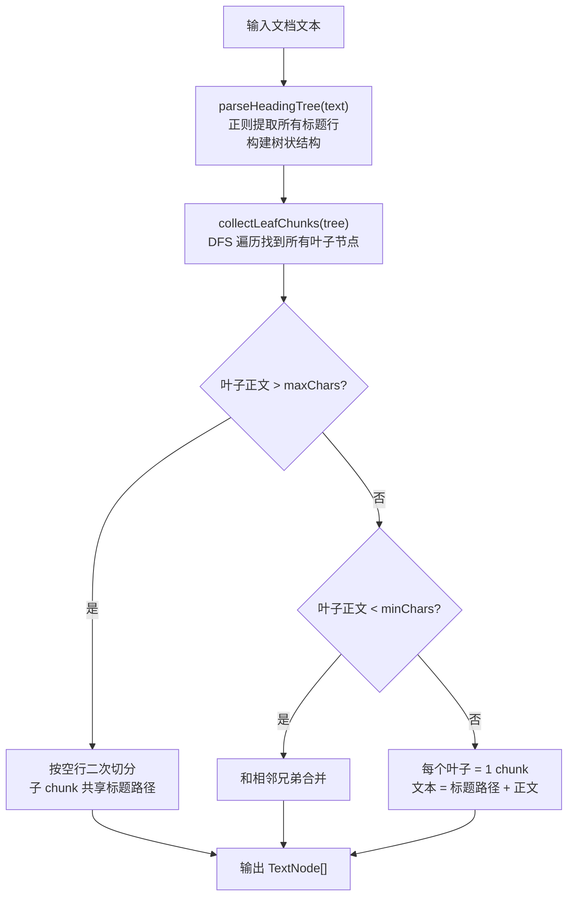

## SemanticSplitter 优化技术方案

### 问题分析

当前 `SemanticSplitter.ts` 的核心问题：

| 问题 | 现状 |
|------|------|
| **切分策略** | 按空行/标题/数字号平铺切块，再用 embedding 做语义二次切分，逻辑复杂且不稳定 |
| **语义孤立** | 每个 chunk 只有自身文本，没有父标题路径，embedding 后"最佳实践"和"常见误区"等子节点语义距离远 |
| **阈值耦合** | breakpointThreshold 和 maxChunkChars 两个参数互相拉扯，调参困难 |
| **低效遍历** | 没利用文档天然结构（Markdown 标题树），而是用通用规则猜测段落边界 |

### 核心设计：基于标题树的递归切分

#### 1. Markdown 标题树模型

```
# 提示词工程                         ← H1 根节点
├── ## 常用提示词框架               ← H2 分支
│   ├── ### 1. CRISPE 框架         ← H3 叶子（子节点为正文）
│   ├── ### 2. BROKE 框架
│   ├── ### 3. COSTAR 框架
│   └── ### 框架选择指南
├── ## 最佳实践                     ← H2 分支
│   ├── ### ✅ 提升效果的技巧       ← H3 叶子
│   └── ### ❌ 常见误区
└── ## 主流推理技术                 ← H2 分支
    ├── ### 1. CoT
    ├── ### 2. ToT
    ├── ### 3. GoT
    ├── ### 4. Self-Consistency
    └── ### 5. ReAct
```

#### 2. Chunk 生成规则

**叶子节点 = chunk**，每个 chunk 的文本 = **祖先标题路径 + 自身正文**

```
chunk 1:
  # 提示词工程 > ## 常用提示词框架 > ### 1. CRISPE 框架
  C (Capacity and Role) - 角色定位
  例: "你是一位资深产品经理"
  ...

chunk 2:
  # 提示词工程 > ## 常用提示词框架 > ### 2. BROKE 框架
  B (Background) - 背景信息
  ...
```

#### 3. 关键优势

- **语义聚拢**：`"CRISPE 框架"` 和 `"BROKE 框架"` 的 embedding 因为共享 `# 常用提示词框架` 前缀而自然拉近
- **确定性切分**：没有调参烦恼，标题结构 = chunk 边界
- **祖先路径即上下文**：RAG 检索时即使只匹配到 `"C(Capacity and Role)"`，也能知道它属于 `CRISPE 框架 > 常用提示词框架`

#### 4. 需要处理的边界情况

| 情况 | 策略 |
|------|------|
| 无标题的纯文本（如文件开头楔子） | 作为独立的 root-level chunk |
| 叶子节点正文过长（> maxChars） | 在该 H3 下按空行二次切分，所有子 chunk 共享同一标题路径 |
| 叶子节点正文过短 | 合并到相邻同级叶子 |
| 多个 H1 共存 | 每个 H1 视为独立子树，路径从所在 H1 开始 |
| 非 Markdown 文档（去掉了） | 已删 prompt.md，目前只处理 Markdown |

### 接口设计

```typescript
interface HeadingNode {
  level: number;       // 1~6
  title: string;       // 标题文本（不含 #）
  content: string;     // 该节点下的正文（不含子标题及其内容）
  children: HeadingNode[];
}

interface HeadingSplitterConfig {
  /** 叶子节点最大字符数，超过此值在同级下用空行再切 */
  maxChunkChars: number;
  /** 叶子节点最小字符数，小于此值和相邻兄弟合并 */
  minChunkChars: number;
  /** 标题路径分隔符 */
  pathSeparator: string;
}
```

### 核心算法流程



### 与原方案的对比

| 维度 | 原方案 | 优化方案 |
|------|--------|----------|
| 切分依据 | 空行/规则 | 标题树（天然语义边界） |
| chunk 上下文 | 仅有正文 | 标题路径 + 正文 |
| 调参 | breakpointThreshold + maxChars | 仅 maxChars（边界情况） |
| embedding 调用 | 全量块 O(n) 次 | 仅在超长二次切分时需要（少） |
| 确定性 | 低（相同输入可能不同结果） | 高（相同输入 = 相同输出） |
| 检索友好度 | 中 | 高（标题路径语义锚定） |

### 调用方式

```typescript
// 使用方式
const splitter = new HeadingTreeSplitter({ maxChunkChars: 1500 });
const doc = new Document({ text: mdContent });
const nodes = await splitter.splitDocuments([doc]);
// nodes[0].text === "# 提示词工程 > ## 常用提示词框架 > ### 1. CRISPE 框架\n\nC (Capacity..."
```

---

这个方案你觉得怎么样？如果方向 OK，我可以开始改写 `SemanticSplitter.ts` 了。